# 界面原型

这边是界面原型文档。

## 一、用户操作界面

### 1. 登录与注册

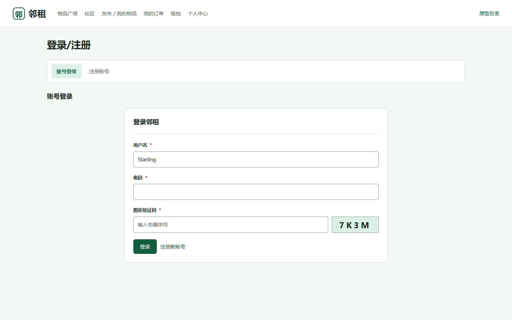

输用户名密码和验证码登录，或者切到注册页。

[查看页面](../../frontend/prototype/01-login.html)

### 2. 个人中心

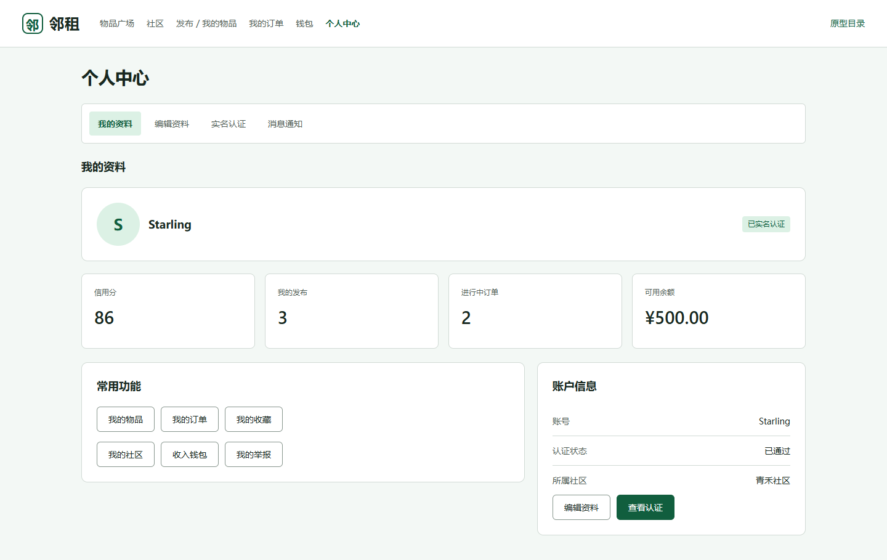

个人中心显示用户资料、认证状态、信用分、物品数量、进行中订单、可用余额，提供常用功能入口。还有编辑资料、实名认证和消息通知。

[查看页面](../../frontend/prototype/02-account.html)

### 3. 社区

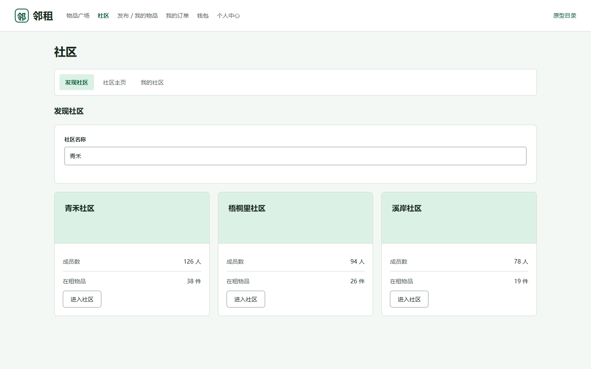

按名称查找社区，查看成员数和在租物品数量，并进入社区主页。还提供社区公告、物品展示和我的社区入口。

[查看页面](../../frontend/prototype/03-community.html)

### 4. 物品广场

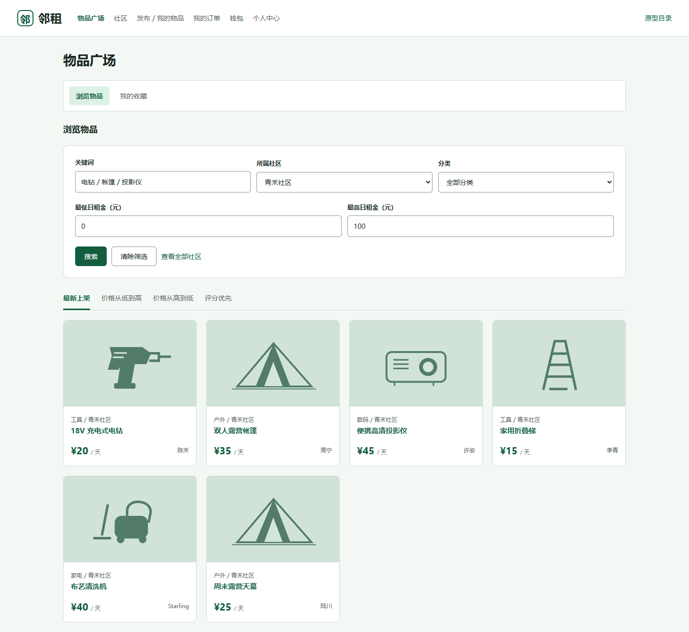

可以按关键词、社区、分类和日租金范围筛选物品，并按价格、评分或上架时间排序。物品卡片展示图片、名称、日租金和出租者，还可以查看收藏。

[查看页面](../../frontend/prototype/04-items.html)

### 5. 物品详情

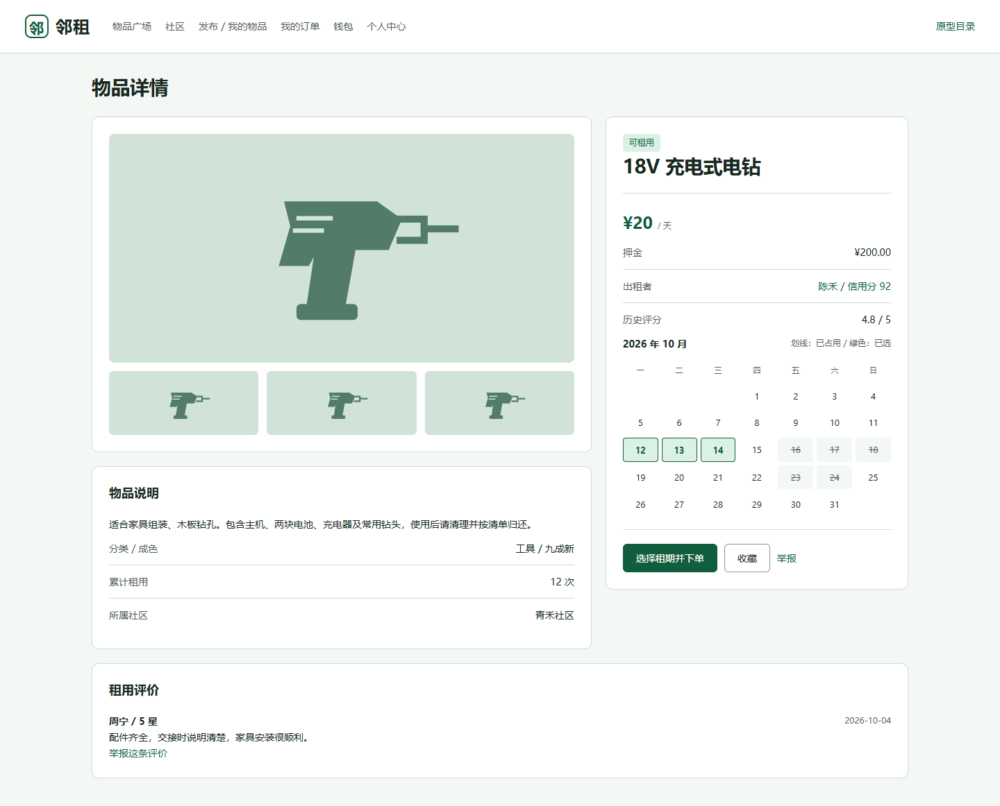

展示图片、描述、成色、日租金、押金、出租者信息和历史评价。用户通过日历查看占用情况，选择租期并下单，还可以收藏或者举报。

[查看页面](../../frontend/prototype/05-item-detail.html)

### 6. 物品发布与管理

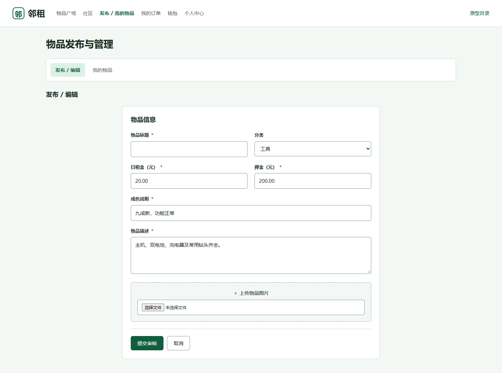

发布和编辑表格，填写标题、分类、日租金、押金、成色及描述，上传图片后提交审核。

[查看页面](../../frontend/prototype/06-publish.html)

### 7. 我的订单

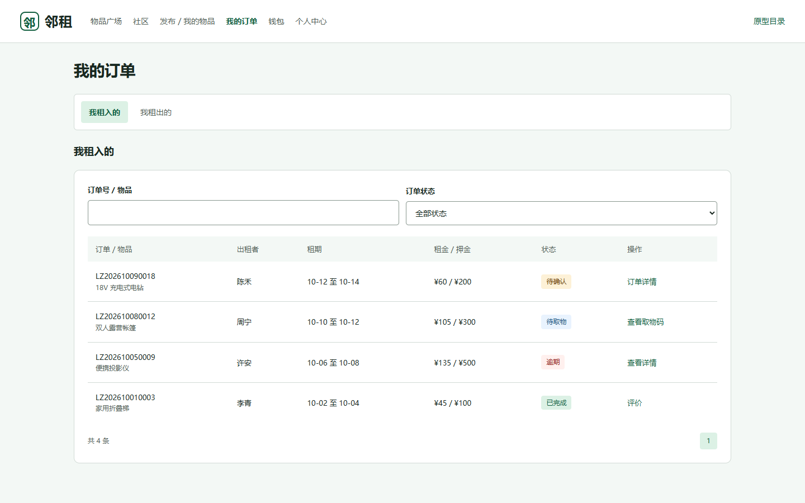

查看租入和租出的订单，支持按订单号、物品及状态筛选。列表展示交易对象、租期、租金、押金和订单状态，并提供订单详情、取物码及评价入口。

[查看页面](../../frontend/prototype/07-orders.html)

### 8. 订单详情与操作

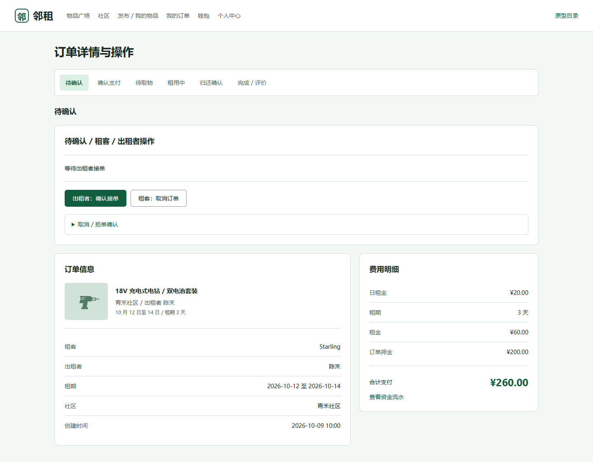

展示待确认订单，包括接单、取消、订单信息与费用明细。还可以通过选项卡展示确认支付、待取物、租用中、归还确认和完成评价等阶段的操作。

[查看页面](../../frontend/prototype/08-order-detail.html)

### 9. 钱包

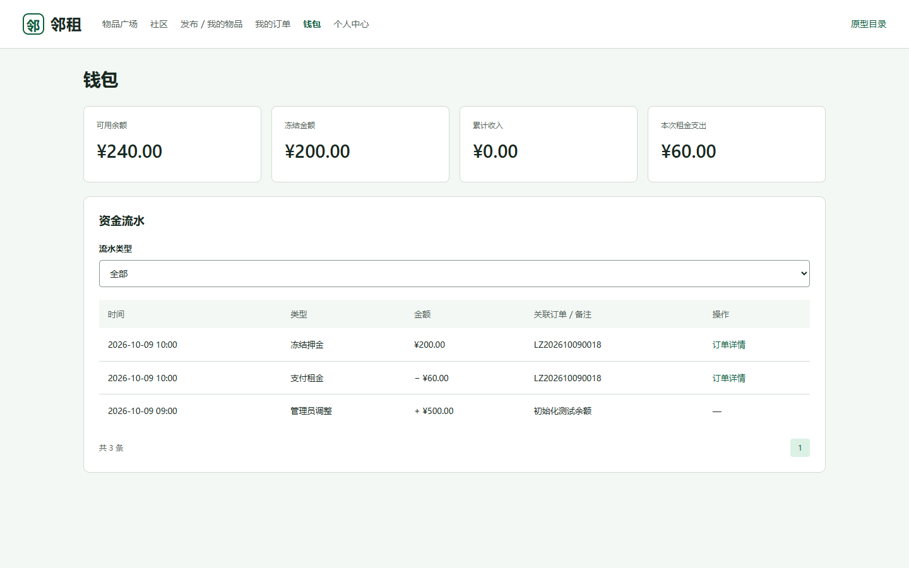

展示可用余额、冻结金额、累计收入和本次租金支出。资金流水按类型筛选，记录时间、金额及关联订单，便于核对租金和押金变化。

[查看页面](../../frontend/prototype/09-wallet.html)

### 10. 纠纷与举报

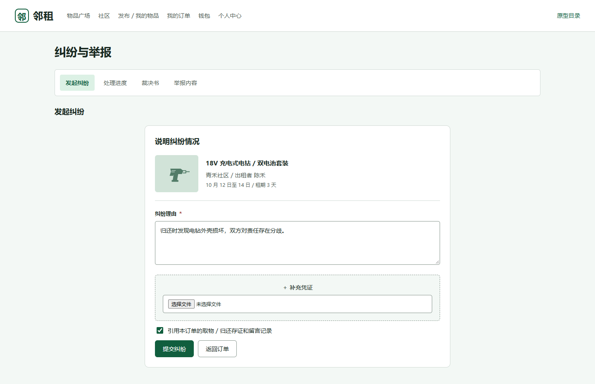

填写纠纷理由、上传凭证，并引用取物、归还存证及留言记录。还可以查看处理进度与裁决书。

[查看页面](../../frontend/prototype/10-dispute.html)

## 二、社区管理员操作界面

### 11. 社区管理

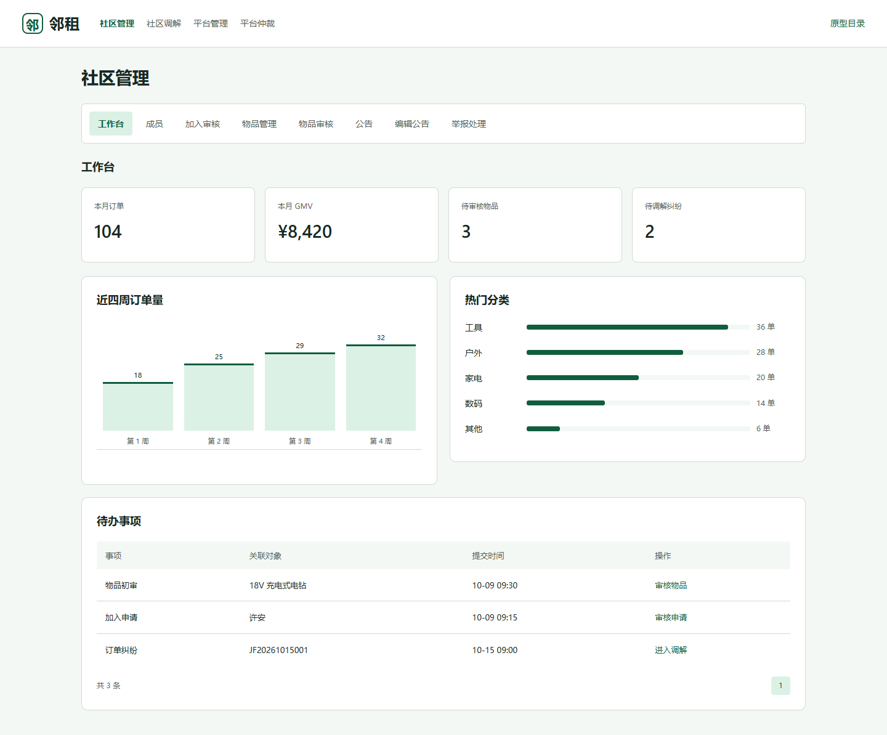

展示本月订单、交易金额、待审核物品、待调解纠纷及待办事项。提供成员管理、加入审核、物品管理与审核、公告编辑和举报处理。

[查看页面](../../frontend/prototype/11-community-admin.html)

### 12. 社区调解

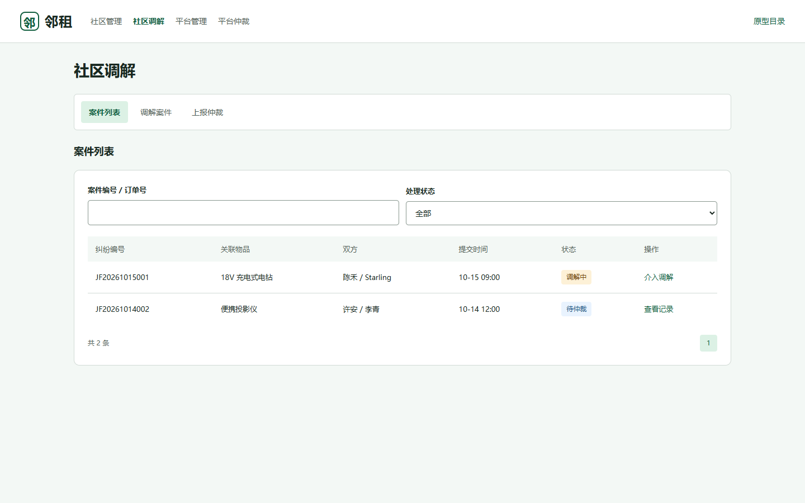

按案件编号、订单号及处理状态查找纠纷，查看关联物品和交易双方。进入案件后核对证据、记录调解意见，未能解决的纠纷可上报。

[查看页面](../../frontend/prototype/12-mediation.html)

## 三、平台管理员操作界面

### 13. 平台管理

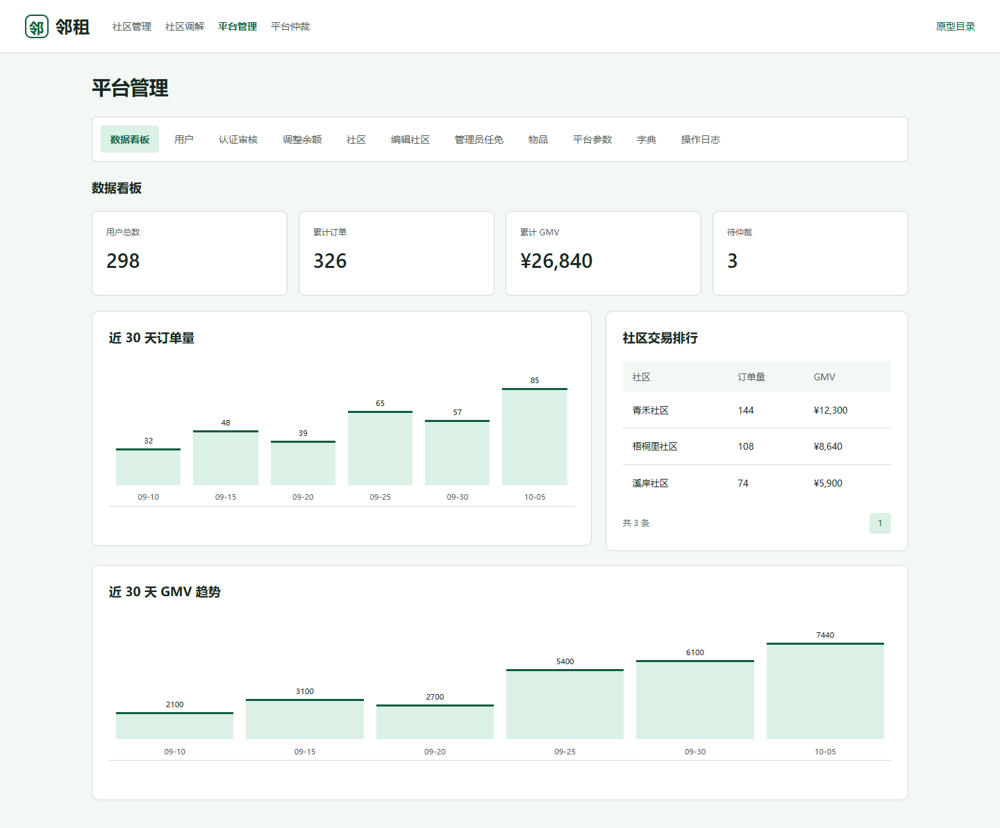

展示用户总数、累计订单、交易金额、待仲裁数量和社区交易排行。提供用户管理、认证审核、余额调整、社区管理、管理员任免、物品管理、平台参数、字典和操作日志。

[查看页面](../../frontend/prototype/13-platform-admin.html)

### 14. 平台仲裁

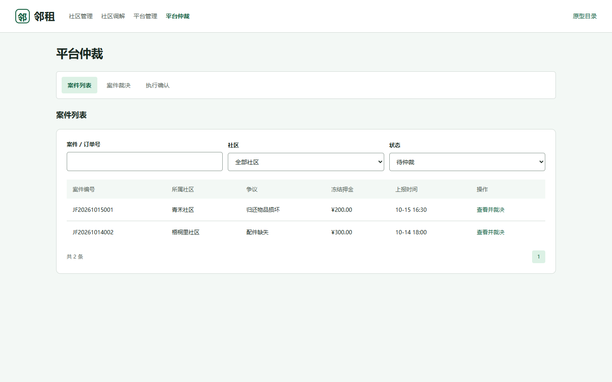

按案件、社区和状态筛选待仲裁纠纷，查看争议内容及冻结押金。同页提供案件裁决与执行确认界面，用于核对证据、填写裁决理由和确认资金处理结果。

[查看页面](../../frontend/prototype/14-arbitration.html)
