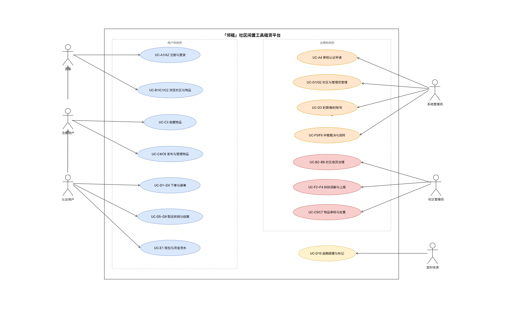
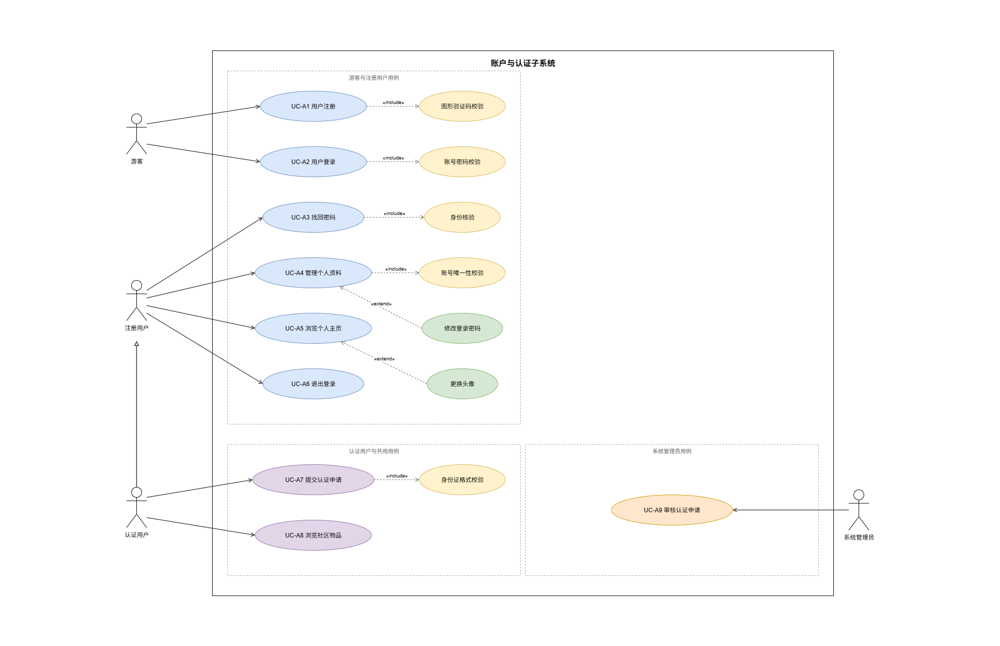
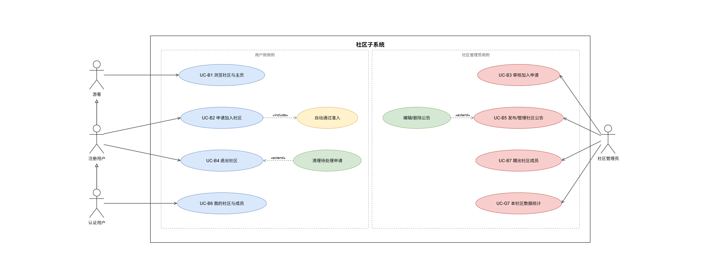
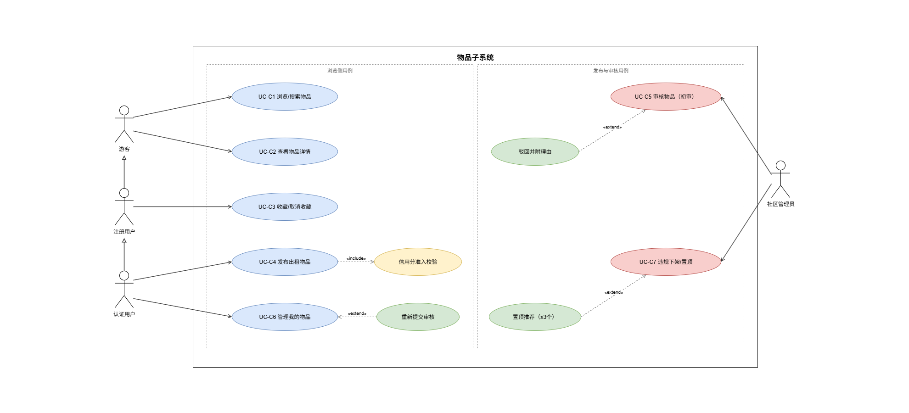
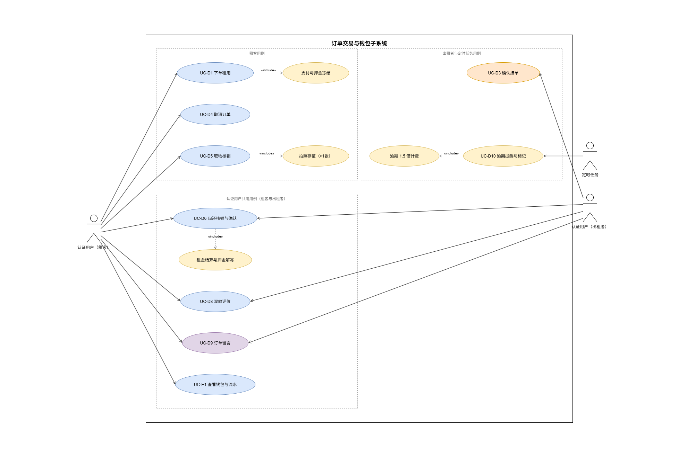
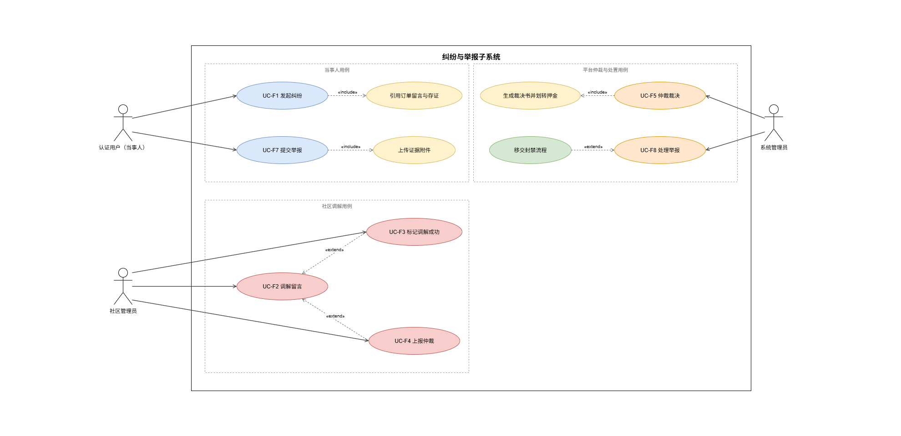
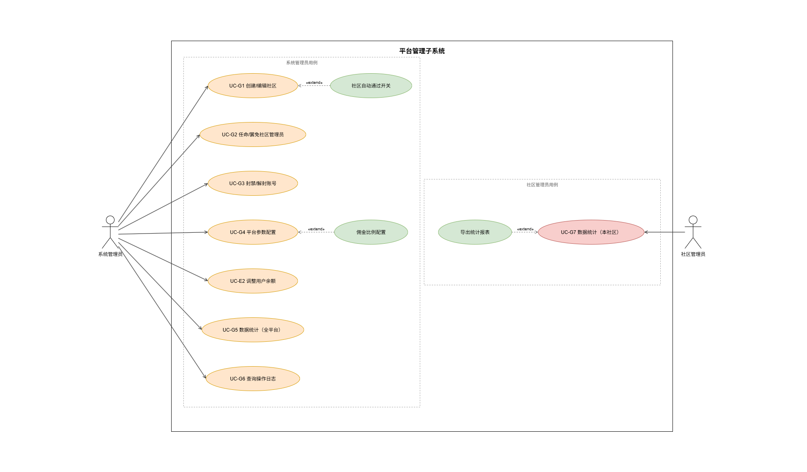

# 「邻租」社区闲置工具租赁平台 需求分析文档

| 文档信息 | 内容 |
| -------- | ---- |
| 文档名称 | 「邻租」社区闲置工具租赁平台需求分析文档 |
| 文档版本 | V1.0（初版） |
| 编写日期 | 2026-10-04 |
| 配套图源 | [diagrams/邻租平台用例图.drawio](diagrams/邻租平台用例图.drawio)（7 页，含总图与 6 张模块子图） |

---

## 目录

- [一、引言](#一引言)
- [二、项目概述](#二项目概述)
- [三、用例模型](#三用例模型)
  - [3.1 参与者](#31-参与者actor)
  - [3.2 用例图](#32-用例图)
  - [3.3 用例清单](#33-用例清单)
  - [3.4 用例规约](#34-用例规约)
- [四、补充规约](#四补充规约)
- [五、附录](#五附录)

---

## 一、引言

### 1.1 编写目的

本文档为「邻租」社区闲置工具租赁平台的需求建模成果，目的在于：

1. 使用 UML 用例模型对系统功能需求进行完整刻画，包括参与者定义、用例图、用例清单与**全部用例的详细规约**；
2. 以补充规约的形式固化非功能性需求、设计约束、业务规则清单与验收标准；
3. 作为后续数据库设计、接口设计与开发、测试验收的需求基线，经团队评审确认后冻结。

### 1.2 项目背景

社区居民普遍持有大量低频使用的工具（电钻、梯子、帐篷、投影仪、童车等），存在"买着贵、用一次、占地方"的痛点；而有临时需求的邻居则面临"购买不划算、借用欠人情"的困境。本项目旨在开发一个**以社区为单位的闲置工具租赁 Web 平台**，实现闲置资源共享、邻里互信交易，并沉淀社区数字化运营能力。

### 1.3 项目目标

- 实现工具的**发布、浏览、下单、支付、取还核销、结算、评价**完整交易闭环（模拟支付）；
- 实现**游客 → 注册用户 → 认证用户 → 社区管理员 → 系统管理员**的五级权限体系（RBAC）；
- 支持社区维度的物品管理与"社区调解 + 平台仲裁"两级纠纷处理流程；
- 满足补充规约中的安全（防越权为验收重点）、性能与数据一致性要求。

### 1.4 术语定义

| 术语 | 说明 |
| ---- | ---- |
| 认证用户 | 提交实名认证申请并通过系统管理员审核的注册用户，可发布物品与下单租用 |
| 社区管理员 | 负责单个社区日常治理（成员、物品、纠纷调解）的角色，由系统管理员任命 |
| 出租者 / 租客 | 同一认证用户在订单中的两个方向：发布物品的一方为出租者，下单租用的一方为租客 |
| 押金冻结 / 解冻 | 下单时将押金从买家可用余额划入冻结金额，归还确认后解冻退回的模拟资金操作 |
| 取物码 / 核销 | 系统为待取物订单生成的一次性取物凭证，取物时由出租者核销并拍照存证 |
| 信用分 | 衡量用户交易可信度的分值（初始 80 分），影响发布与下单资格，规则见 BR-04 / BR-05 |
| RBAC | 基于角色的访问控制（Role-Based Access Control） |
| 越权 | 用户访问不具备权限的资源（如社区管理员访问其他社区数据），本项目验收重点 |

---

## 二、项目概述

### 2.1 产品定位

以真实社区（小区 / 商圈 / 园区）为单位的**近距离双边租赁平台**，强调"同社区、可自提、可面交"，区别于异地快递租赁平台。课程实现为纯 Web 端（响应式布局）。

### 2.2 用户角色与权限体系

系统采用**"功能与身份解耦"**的设计：出租与租用是认证用户的两个功能方向，不作为独立角色。角色按权限等级划分：

```
游客 → 注册用户 → 认证用户（双向交易）→ 社区管理员（局部治理）→ 系统管理员（全局治理+资金）
```

| 角色 | 说明 | 获取方式 |
| ---- | ---- | -------- |
| 游客 | 未登录访客，仅可浏览与搜索 | 无需操作 |
| 注册用户 | 完成账号密码注册，可浏览、收藏、申请加入社区、提交认证申请 | 账号 + 密码注册 |
| 认证用户 | 提交认证申请并通过系统管理员审核，解锁发布与交易功能 | 提交认证申请 → 系统管理员审核 |
| 社区管理员 | 管理单个社区的成员、物品审核、公告与纠纷调解 | 系统管理员在后台指定任命 |
| 系统管理员 | 平台全局管理（认证审核、仲裁、配置、统计），拥有全部权限 | 数据库预置账号 |

完整权限矩阵见 [附录 A](#附录-a权限矩阵)。

### 2.3 运行环境与约束

| 项目 | 要求 |
| ---- | ---- |
| 客户端 | 纯 Web 端（响应式布局），支持 Chrome / Edge 浏览器 |
| 服务端 | Java（Spring Boot + MyBatis-Plus） |
| 数据库 | MySQL |
| 前端 | JavaScript（HTML/CSS/JS，推荐 Vue3 + Element Plus） |
| 图片存储 | 服务器本地目录存储，数据库保存相对路径 |
| 部署 | 演示环境，演示前提供初始化 SQL（预置系统管理员、示例社区、示例物品与用户） |

## 三、用例模型

### 3.1 参与者（Actor）

| 参与者 | 类型 | 说明 | 权限要点 |
| ------ | ---- | ---- | -------- |
| 游客 | 主要参与者 | 未登录访客 | 浏览社区、浏览/搜索物品、查看物品详情、注册 |
| 注册用户 | 主要参与者 | 已注册未认证 | 游客全部能力 + 登录、收藏、申请加入/退出社区、提交认证申请、管理个人资料 |
| 认证用户 | 主要参与者 | 已通过认证审核 | 注册用户全部能力 + 发布物品、下单租用、订单全流程操作、评价、发起纠纷与举报 |
| 社区管理员 | 主要参与者 | 认证用户 + 平台任命 | 认证用户全部能力 + 本社区成员管理、物品审核/下架/置顶、公告管理、加入申请审核、纠纷调解、上报仲裁、本社区数据统计 |
| 系统管理员 | 主要参与者 | 平台运营方 | 全部权限：认证审核、仲裁裁决、社区创建与管理员任命、账号封禁、平台配置、操作日志、全平台统计 |
| 定时任务 | 辅助参与者 | 系统时钟 | 到期前 1 天逾期提醒、逾期自动标记与 1.5 倍计费（UC-D10） |

参与者泛化关系（继承下级参与者的全部用例）：

```
社区管理员 ──▷ 认证用户 ──▷ 注册用户 ──▷ 游客
```

> 说明：系统管理员为独立参与者，拥有全平台管理用例；按课程简化，系统管理员账号同时具备普通用户交易功能（真实产品中为利益隔离禁用）。

### 3.2 用例图

系统用例模型由 1 张总用例图与 6 张模块子图组成。总图给出五级参与者与核心用例概览；子图按模块展开全部用例及 include / extend 关系。图源文件：`diagrams/邻租平台用例图.drawio`（可在 draw.io 中打开编辑）。

#### 3.2.1 总用例图



#### 3.2.2 账户与认证子系统



#### 3.2.3 社区子系统



#### 3.2.4 物品子系统



#### 3.2.5 订单交易与钱包子系统



#### 3.2.6 纠纷与举报子系统



#### 3.2.7 平台管理子系统



### 3.3 用例清单

用例编号规则：`UC-<模块字母><序号>`，模块字母 A=账户、B=社区、C=物品、D=订单、E=钱包、F=纠纷、G=平台管理；二级用例（`«include»` / `«extend»`）编号为 `UC-<父用例号>.<子序号>`。全部用例均提供详细规约（见 3.4 节）。

> 用例图绘制规范（本次修订）：参与者与用例之间统一使用**斜直线 + 指向用例的开放箭头**；用例按"可触发该用例的参与者"分区摆放，参与者置于其专属用例最近的一侧；一级主用例标注 `UC-xN` 编号，二级用例以 `«include»`（黄色）与 `«extend»`（绿色）挂接在父用例上。

| 编号 | 用例名称 | 主要参与者 | 简要说明 | 优先级 |
| ---- | -------- | ---------- | -------- | :----: |
| UC-A1 | 用户注册 | 游客 | 账号+密码注册，成为注册用户 | 高 |
| UC-A2 | 用户登录 | 注册用户 | 账号密码登录（含图形验证码） | 高 |
| UC-A3 | 提交认证申请 | 注册用户 | 填写姓名+身份证号申请实名认证 | 高 |
| UC-A4 | 审核认证申请 | 系统管理员 | 通过 / 驳回认证申请，通过后升级为认证用户 | 高 |
| UC-A5 | 浏览个人主页 | 注册用户 | 查看本人主页：资料概要、物品、评价与信用分 | 中 |
| UC-A6 | 退出登录 | 注册用户 | 注销当前登录会话，返回游客态 | 低 |
| UC-A7 | 提交认证申请 | 认证用户 | 提交姓名+身份证号实名认证申请（与 UC-A3 同一用例，认证用户视角） | 高 |
| UC-A8 | 浏览社区物品 | 认证用户 | 以认证身份浏览所在社区的物品列表 | 中 |
| UC-A9 | 审核认证申请 | 系统管理员 | 通过/驳回认证申请，通过后升级为认证用户（本表原 UC-A4 的新编号） | 高 |
| UC-A1.1 | 账号唯一性校验 | （系统） | UC-A1 的 «include» 二级用例：校验账号是否已被注册 | 高 |
| UC-A2.1 | 图形验证码校验 | （系统） | UC-A2 的 «include» 二级用例：校验图形验证码正确性 | 高 |
| UC-A2.2 | 账号密码校验 | （系统） | UC-A2 的 «include» 二级用例：BCrypt 比对账号密码 | 高 |
| UC-A3.1 | 身份核验 | （系统） | UC-A3 的 «include» 二级用例：按姓名+身份证号核验身份 | 高 |
| UC-A4.1 | 修改登录密码 | 注册用户 | UC-A4 的 «extend» 二级用例：校验原密码后更新新密码 | 中 |
| UC-A4.2 | 更换头像 | 注册用户 | UC-A4 的 «extend» 二级用例：上传并替换头像 | 低 |
| UC-A7.1 | 身份证格式校验 | （系统） | UC-A7 的 «include» 二级用例：18 位身份证号校验位校验 | 高 |
| UC-B1 | 浏览社区与社区主页 | 游客 | 查看社区列表、搜索社区、查看社区主页 | 高 |
| UC-B2 | 申请加入社区 | 注册用户 | 选择社区提交加入申请 | 高 |
| UC-B3 | 审核加入申请 | 社区管理员 | 审核本社区加入申请（可配置自动通过） | 中 |
| UC-B4 | 退出社区 | 注册用户 | 退出所在社区（有进行中订单除外） | 中 |
| UC-B5 | 发布/管理社区公告 | 社区管理员 | 发布、编辑、删除本社区公告 | 中 |
| UC-B6 | 踢出社区成员 | 社区管理员 | 将成员移出本社区（有进行中订单除外） | 中 |
| UC-C1 | 浏览/搜索物品 | 游客 | 关键词搜索、分类/价格筛选与排序 | 高 |
| UC-C2 | 查看物品详情 | 游客 | 图片轮播、租期日历、出租者信用信息、评价列表 | 高 |
| UC-C3 | 收藏/取消收藏 | 注册用户 | 收藏或取消收藏物品 | 中 |
| UC-C4 | 发布出租物品 | 认证用户 | 填写物品信息并提交，进入待审核状态 | 高 |
| UC-C5 | 审核物品（初审） | 社区管理员 | 审核本社区待审核物品：通过上架 / 驳回 | 高 |
| UC-C6 | 管理我的物品 | 认证用户 | 编辑、暂停出租、恢复出租、删除物品 | 高 |
| UC-C7 | 违规下架/置顶推荐 | 社区管理员 | 违规物品下架；置顶推荐（同时≤3 个） | 中 |
| UC-D1 | 下单租用 | 认证用户（租客） | 选租期、确认订单并提交 | 高 |
| UC-D2 | 支付与押金冻结 | 认证用户（租客） | 模拟支付租金，冻结押金（UC-D1 的包含用例） | 高 |
| UC-D3 | 确认接单 | 认证用户（出租者） | 出租者确认接单，订单进入待取物 | 高 |
| UC-D4 | 取消订单 | 认证用户（租客） | 接单前取消订单，退回款项并解冻押金 | 中 |
| UC-D5 | 取物核销 | 认证用户（双方） | 取物码核销 + 拍照存证，订单进入租用中 | 高 |
| UC-D6 | 归还核销与确认归还 | 认证用户（双方） | 租客发起归还并拍照，出租者核验确认 | 高 |
| UC-D7 | 租金结算与押金解冻 | （系统自动） | 扣佣金后租金入出租者余额，押金解冻退回（UC-D6 的包含用例） | 高 |
| UC-D8 | 双向评价 | 认证用户（双方） | 订单完成后 7 天内互评（星级+文字），影响信用分 | 高 |
| UC-D9 | 订单留言 | 认证用户（双方） | 订单详情页内双方异步留言沟通 | 中 |
| UC-D10 | 逾期提醒与标记 | 定时任务 | 到期前提醒；逾期自动标记并按 1.5 倍/日计费 | 中 |
| UC-E1 | 查看钱包与资金流水 | 认证用户 | 查看余额、冻结金额、累计收入与流水明细 | 中 |
| UC-E2 | 调整用户余额 | 系统管理员 | 为用户充值/扣减测试余额（模拟支付配套，见平台管理用例图） | 中 |
| UC-F1 | 发起纠纷 | 认证用户（当事人） | 对进行中订单发起纠纷，填写理由并上传凭证 | 高 |
| UC-F2 | 调解留言 | 社区管理员 | 查看凭证与聊天记录，留言调解 | 高 |
| UC-F3 | 标记调解成功 | 社区管理员 | 调解达成时标记，订单恢复正常流转（UC-F2 的扩展用例） | 中 |
| UC-F4 | 上报仲裁 | 社区管理员 | 调解不成或涉资金时上报系统管理员（UC-F2 的扩展用例） | 高 |
| UC-F5 | 仲裁裁决 | 系统管理员 | 依据证据裁决押金归属 | 高 |
| UC-F6 | 生成裁决书并划转押金 | 系统管理员 | 生成裁决书并按裁决划转资金（UC-F5 的包含用例） | 高 |
| UC-F7 | 提交举报 | 认证用户 | 对物品、用户、评价提交举报并附证据 | 中 |
| UC-F8 | 处理举报 | 社区管理员 / 系统管理员 | 审核举报并处置（下架、封禁线索等） | 中 |
| UC-G1 | 创建/编辑社区 | 系统管理员 | 创建社区（名称/简介/封面）或编辑社区信息 | 高 |
| UC-G2 | 任命/罢免社区管理员 | 系统管理员 | 指定或撤换社区管理员 | 高 |
| UC-G3 | 封禁/解封账号 | 系统管理员 | 封禁违规账号、解封申诉账号 | 高 |
| UC-G4 | 平台参数配置 | 系统管理员 | 佣金比例、社区准入开关等全局配置 | 高 |
| UC-G5 | 数据统计（全平台） | 系统管理员 | 平台用户数、订单量、GMV 趋势、社区排行 | 中 |
| UC-G6 | 查询操作日志 | 系统管理员 | 查询两级管理员全部管理操作日志 | 中 |
| UC-G7 | 数据统计（本社区） | 社区管理员 | 本社区订单量、GMV、热门分类、纠纷数 | 中 |

### 3.4 用例规约

规约约定：

- **基本流程**编号为主干成功场景步骤；**扩展流程**以"步骤号+字母"（如 3a）对应基本流程中的分支点；
- **业务规则**引用 [4.3 节业务规则清单](#43-业务规则清单)中的 BR 编号；
- 涉及资金的操作均要求钱包变动与流水记录严格一致（BR-21）。

#### A. 账户与认证（UC-A1 ~ UC-A5）

##### UC-A1 用户注册

| 项目 | 内容 |
| ---- | ---- |
| 用例编号 / 名称 | UC-A1 用户注册 |
| 参与者 | 主：游客 |
| 优先级 | 高 |
| 简要说明 | 游客以账号（用户名/邮箱）+ 密码完成注册，成为注册用户并自动登录 |
| 前置条件 | 所填账号未被注册 |
| 后置条件 | 新增用户记录（role=注册用户）、钱包账户（余额 0）创建成功 |

**基本流程：**

1. 游客进入注册页，输入账号、密码、确认密码；
2. 系统校验账号唯一性与密码格式（长度 ≥ 6）；
3. 系统创建用户（密码 BCrypt 加密存储）并初始化钱包账户，自动登录进入首页。

**扩展流程：**

- 2a. 账号已存在：提示"账号已被注册"，返回步骤 1；
- 2b. 两次密码不一致或格式不合规：提示错误，返回步骤 1。

**业务规则：** BR-01、BR-15
**相关用例：** UC-A2（注册后登录使用）

##### UC-A2 用户登录

| 项目 | 内容 |
| ---- | ---- |
| 用例编号 / 名称 | UC-A2 用户登录 |
| 参与者 | 主：注册用户（含更高级角色） |
| 优先级 | 高 |
| 简要说明 | 用户以账号密码登录，登录需通过图形验证码校验 |
| 前置条件 | 账号已注册且未被封禁 |
| 后置条件 | 建立登录会话（JWT/Session），跳转首页 |

**基本流程：**

1. 用户输入账号、密码、图形验证码；
2. 系统校验验证码正确性；
3. 系统校验账号密码（BCrypt 比对）；
4. 登录成功，按角色进入对应首页（系统管理员进入后台）。

**扩展流程：**

- 2a. 图形验证码错误：提示并刷新验证码，返回步骤 1；
- 3a. 账号或密码错误：提示错误，返回步骤 1；
- 3b. 账号处于封禁状态：提示"账号已被封禁"，终止用例（BR-22）。

**业务规则：** BR-15、BR-22
**相关用例：** UC-G3（封禁来源）

##### UC-A3 提交认证申请

| 项目 | 内容 |
| ---- | ---- |
| 用例编号 / 名称 | UC-A3 提交认证申请 |
| 参与者 | 主：注册用户 |
| 优先级 | 高 |
| 简要说明 | 注册用户填写真实姓名与身份证号提交实名认证申请，等待系统管理员审核 |
| 前置条件 | 用户已登录且当前为注册用户；无待审核的认证申请 |
| 后置条件 | 生成认证申请记录（状态=待审核，身份证号加密存储） |

**基本流程：**

1. 用户在个人中心进入"实名认证"页；
2. 填写真实姓名、身份证号，确认提交；
3. 系统校验身份证号格式（18 位校验位）；
4. 系统保存申请（身份证号加密入库，页面脱敏显示），状态置为"待审核"，提示等待审核。

**扩展流程：**

- 2a. 已存在待审核申请：提示"已有申请在审核中"，终止用例；
- 2b. 用户已是认证用户：入口不可见 / 提示无需认证；
- 3a. 身份证号格式错误：提示错误，返回步骤 2。

**业务规则：** BR-03、BR-15
**相关用例：** UC-A4（后续审核）

##### UC-A4 审核认证申请

| 项目 | 内容 |
| ---- | ---- |
| 用例编号 / 名称 | UC-A4 审核认证申请 |
| 参与者 | 主：系统管理员 |
| 优先级 | 高 |
| 简要说明 | 系统管理员对待审核认证申请进行审核，通过后申请人升级为认证用户 |
| 前置条件 | 存在待审核的认证申请 |
| 后置条件 | 审核通过：用户角色升级为认证用户；驳回：申请状态为已驳回（可重新提交） |

**基本流程：**

1. 系统管理员进入后台"认证审核"列表，查看申请人姓名与脱敏身份证号；
2. 选择"通过"或"驳回"（驳回须填写驳回理由）；
3. 系统更新申请状态并通过站内消息通知申请人；
4. 通过时系统将用户角色升级为认证用户。

**扩展流程：**

- 1a. 无待审核申请：列表为空，用例结束；
- 2a. 驳回未填理由：系统要求必填，返回步骤 2。

**业务规则：** BR-01、BR-03、BR-14（操作留痕）
**相关用例：** UC-A3（来源）

##### UC-A5 管理个人资料

| 项目 | 内容 |
| ---- | ---- |
| 用例编号 / 名称 | UC-A5 管理个人资料 |
| 参与者 | 主：注册用户（含更高级角色） |
| 优先级 | 中 |
| 简要说明 | 用户修改昵称、头像、简介，或修改登录密码 |
| 前置条件 | 用户已登录 |
| 后置条件 | 资料或密码更新成功 |

**基本流程：**

1. 用户在个人中心编辑昵称 / 简介 / 上传头像，保存；
2. 系统校验字段合法性（昵称长度、图片格式与大小）后保存；
3. 修改密码时输入原密码与新密码，系统校验原密码正确后更新。

**扩展流程：**

- 1a. 头像格式不支持或超过大小限制：提示并取消上传；
- 3a. 原密码错误：提示错误，返回步骤 3。

**业务规则：** BR-15

#### B. 社区（UC-B1 ~ UC-B6）

##### UC-B1 浏览社区与社区主页

| 项目 | 内容 |
| ---- | ---- |
| 用例编号 / 名称 | UC-B1 浏览社区与社区主页 |
| 参与者 | 主：游客（注册用户及更高级角色继承） |
| 优先级 | 高 |
| 简要说明 | 查看社区列表（名称、简介、成员数、在租物品数）、按关键词搜索、进入社区主页查看公告与置顶物品 |
| 前置条件 | 无（游客可用） |
| 后置条件 | 无数据变更 |

**基本流程：**

1. 用户打开社区列表页，系统展示社区卡片（名称、简介、成员数、在租物品数）；
2. 用户可输入关键词搜索，或点击社区进入主页；
3. 社区主页展示社区公告、置顶物品、最新上架物品与成员/交易统计。

**扩展流程：**

- 2a. 搜索无结果：展示空态提示。

**业务规则：** 无特别规则
**相关用例：** UC-B2（加入社区）

##### UC-B2 申请加入社区

| 项目 | 内容 |
| ---- | ---- |
| 用例编号 / 名称 | UC-B2 申请加入社区 |
| 参与者 | 主：注册用户 |
| 优先级 | 高 |
| 简要说明 | 用户选择社区提交加入申请，由社区管理员审核（可配置自动通过） |
| 前置条件 | 已登录、为注册用户及以上、尚未加入该社区、无待处理的加入申请 |
| 后置条件 | 生成加入申请（状态=待审核），或社区配置自动通过时直接成为成员 |

**基本流程：**

1. 用户在社区主页点击"申请加入"；
2. 系统生成加入申请并通知社区管理员；
3. 社区管理员审核通过后，用户成为该社区成员并收到通知。

**扩展流程：**

- 1a. 社区配置为"自动通过"：系统直接建立成员关系，跳过步骤 2~3（BR-16）；
- 1b. 已申请待审核：提示重复申请；
- 1c. 已是该社区成员：入口不可见。

**业务规则：** BR-01、BR-16
**相关用例：** UC-B3（审核）、UC-B4（退出）

##### UC-B3 审核加入申请

| 项目 | 内容 |
| ---- | ---- |
| 用例编号 / 名称 | UC-B3 审核加入申请 |
| 参与者 | 主：社区管理员 |
| 优先级 | 中 |
| 简要说明 | 社区管理员审核本社区的加入申请：通过 / 拒绝 |
| 前置条件 | 社区管理员已登录；存在待审核的加入申请（且社区未配置自动通过） |
| 后置条件 | 通过：申请人成为社区成员；拒绝：申请状态更新并通知 |

**基本流程：**

1. 社区管理员进入"成员管理 → 加入申请"列表；
2. 查看申请人信息，选择"通过"或"拒绝"；
3. 系统更新申请状态、维护成员数，并通知申请人。

**扩展流程：**

- 1a. 无待审核申请：列表为空，用例结束。

**业务规则：** BR-13（行级数据隔离）、BR-14（操作留痕）、BR-16

##### UC-B4 退出社区

| 项目 | 内容 |
| ---- | ---- |
| 用例编号 / 名称 | UC-B4 退出社区 |
| 参与者 | 主：注册用户（社区成员） |
| 优先级 | 中 |
| 简要说明 | 成员主动退出所在社区；存在进行中订单时禁止退出 |
| 前置条件 | 用户是社区成员；在该社区无进行中订单（待确认/待取物/租用中/待归还/纠纷中） |
| 后置条件 | 成员关系删除，成员数减一 |

**基本流程：**

1. 用户在"我的社区"选择退出；
2. 系统检查该社区下是否存在进行中订单；
3. 校验通过后删除成员关系并通知。

**扩展流程：**

- 2a. 存在进行中订单：提示"有进行中的订单，暂不能退出"，终止用例（BR-17）。

**业务规则：** BR-17

##### UC-B5 发布/管理社区公告

| 项目 | 内容 |
| ---- | ---- |
| 用例编号 / 名称 | UC-B5 发布/管理社区公告 |
| 参与者 | 主：社区管理员 |
| 优先级 | 中 |
| 简要说明 | 社区管理员发布、编辑、删除本社区公告（文字，可配图片） |
| 前置条件 | 社区管理员已登录 |
| 后置条件 | 公告新增 / 更新 / 删除成功，社区主页同步展示 |

**基本流程：**

1. 社区管理员进入"公告管理"，点击发布，填写标题与正文；
2. 系统保存公告并展示在社区主页公告栏；
3. 管理员可对已有公告执行编辑或删除。

**扩展流程：**

- 1a. 标题或正文为空：校验失败提示，返回步骤 1；
- 3a. 删除需二次确认，确认后执行。

**业务规则：** BR-13、BR-14

##### UC-B6 踢出社区成员

| 项目 | 内容 |
| ---- | ---- |
| 用例编号 / 名称 | UC-B6 踢出社区成员 |
| 参与者 | 主：社区管理员 |
| 优先级 | 中 |
| 简要说明 | 社区管理员将违规成员移出本社区；成员有进行中订单时禁止踢出 |
| 前置条件 | 目标用户是本社区成员且非社区管理员本人；目标用户在本社区无进行中订单 |
| 后置条件 | 成员关系删除，成员数减一，操作写入日志 |

**基本流程：**

1. 社区管理员在成员列表中选择目标成员，点击"踢出"；
2. 系统检查目标成员在本社区是否存在进行中订单；
3. 二次确认后删除成员关系，系统消息通知被踢成员。

**扩展流程：**

- 2a. 存在进行中订单：提示禁止操作并说明原因，终止用例（BR-17）。

**业务规则：** BR-13、BR-14、BR-17

#### C. 物品（UC-C1 ~ UC-C7）

##### UC-C1 浏览/搜索物品

| 项目 | 内容 |
| ---- | ---- |
| 用例编号 / 名称 | UC-C1 浏览/搜索物品 |
| 参与者 | 主：游客（注册用户及更高级角色继承） |
| 优先级 | 高 |
| 简要说明 | 按关键词（标题/描述模糊匹配）、分类、价格区间筛选物品，支持按最新/价格/评分排序 |
| 前置条件 | 无（游客可用） |
| 后置条件 | 无数据变更 |

**基本流程：**

1. 用户进入物品列表页，系统默认展示当前用户所在社区的物品（游客展示全部社区）；
2. 用户可切换浏览其他社区、输入关键词、选择分类与价格区间；
3. 用户选择排序方式（最新 / 价格升序降序 / 评分），系统返回筛选结果。

**扩展流程：**

- 1a. 用户未加入任何社区：默认展示全部社区物品；
- 2a. 无匹配结果：展示空态提示。

**业务规则：** BR-02（默认同社区展示）
**相关用例：** UC-C2（详情）

##### UC-C2 查看物品详情

| 项目 | 内容 |
| ---- | ---- |
| 用例编号 / 名称 | UC-C2 查看物品详情 |
| 参与者 | 主：游客（注册用户及更高级角色继承） |
| 优先级 | 高 |
| 简要说明 | 查看物品图片轮播、描述、租金/押金、可租日历（已占用时段灰显）、出租者信用与历史评价、累计租用次数 |
| 前置条件 | 物品处于上架状态 |
| 后置条件 | 无数据变更 |

**基本流程：**

1. 用户从列表进入物品详情页；
2. 系统展示物品图片、标题、描述、成色说明、租金（元/天）、押金、出租者信息（昵称、信用分、历史评分）；
3. 系统展示可租日历，已被订单占用的时段灰显；
4. 页面底部展示该物品累计租用次数与评价列表。

**扩展流程：**

- 1a. 物品已被下架 / 删除：提示物品不存在或已下架。

**业务规则：** BR-15（出租者信息脱敏展示）
**相关用例：** UC-D1（从详情页下单）

##### UC-C3 收藏/取消收藏

| 项目 | 内容 |
| ---- | ---- |
| 用例编号 / 名称 | UC-C3 收藏/取消收藏 |
| 参与者 | 主：注册用户 |
| 优先级 | 中 |
| 简要说明 | 注册用户收藏感兴趣物品，在个人中心收藏夹中管理，可取消收藏 |
| 前置条件 | 已登录（注册用户及以上） |
| 后置条件 | 收藏关系建立或解除 |

**基本流程：**

1. 用户在物品详情页点击"收藏"，系统建立收藏关系；
2. 用户在个人中心"收藏夹"查看收藏列表，可点击取消收藏。

**扩展流程：**

- 1a. 已收藏：按钮显示为"已收藏"，再次点击取消收藏。

**业务规则：** 无特别规则

##### UC-C4 发布出租物品

| 项目 | 内容 |
| ---- | ---- |
| 用例编号 / 名称 | UC-C4 发布出租物品 |
| 参与者 | 主：认证用户 |
| 优先级 | 高 |
| 简要说明 | 认证用户填写物品信息（标题、描述、分类、照片≥1 张、租金、押金、成色说明）发布出租，发布后进入待审核状态 |
| 前置条件 | 已登录且为认证用户；信用分 ≥ 60（押金 > 500 元时） |
| 后置条件 | 物品记录创建（状态=待审核），等待社区管理员初审 |

**基本流程：**

1. 用户点击"发布物品"，填写标题、描述、分类（工具/家电/户外/数码/其他）、成色说明、租金（元/天）、押金金额，上传照片（≥1 张）；
2. 系统校验必填项、图片数量与格式；
3. 系统校验信用分限制：押金 > 500 元时要求信用分 ≥ 60；
4. 校验通过后物品进入"待审核"状态，等待所属社区管理员初审（«include» UC-C5）。

**扩展流程：**

- 2a. 必填项缺失或图片不足：提示错误，返回步骤 1；
- 3a. 信用分不足 60 且押金 > 500：提示"信用分不足，无法发布高押金物品"，终止用例（BR-05）。

**业务规则：** BR-03、BR-05、BR-19
**相关用例：** UC-C5（审核）

##### UC-C5 审核物品（初审）

| 项目 | 内容 |
| ---- | ---- |
| 用例编号 / 名称 | UC-C5 审核物品（初审） |
| 参与者 | 主：社区管理员 |
| 优先级 | 高 |
| 简要说明 | 社区管理员审核本社区待审核物品：通过后上架，驳回附理由退回出租者修改 |
| 前置条件 | 社区管理员已登录；本社区存在待审核物品 |
| 后置条件 | 物品状态更新为"已上架"或"已驳回"（附驳回理由），操作写入日志 |

**基本流程：**

1. 社区管理员进入"物品审核"待办队列，查看物品详情与图片；
2. 选择"通过"：物品上架并出现在本社区物品列表；
3. 选择"驳回"：必填驳回理由，物品状态置为"已驳回"，系统通知出租者。

**扩展流程：**

- 3a. 驳回未填理由：系统要求必填，返回步骤 3；
- 3b. 出租者可修改后重新提交，回到 UC-C4。

**业务规则：** BR-13、BR-14、BR-19
**相关用例：** UC-C4（来源）、UC-C7（后续违规处置）

##### UC-C6 管理我的物品

| 项目 | 内容 |
| ---- | ---- |
| 用例编号 / 名称 | UC-C6 管理我的物品 |
| 参与者 | 主：认证用户 |
| 优先级 | 高 |
| 简要说明 | 出租者编辑物品信息、暂停/恢复出租、删除物品（无进行中订单时） |
| 前置条件 | 已登录且为物品所有者 |
| 后置条件 | 物品信息或状态更新；删除时物品记录移除 |

**基本流程：**

1. 用户在"我的发布"列表选择物品进行操作；
2. 编辑：修改标题、描述、租金、押金等，保存后物品回到"待审核"状态重新初审；
3. 暂停/恢复：切换物品出租状态（暂停后不可被下单，已有订单不受影响）；
4. 删除：仅当该物品无进行中订单时允许，二次确认后删除。

**扩展流程：**

- 4a. 存在进行中订单：提示禁止删除（BR-17）；
- 2a. 编辑押金 > 500 元时重新执行信用分校验（BR-05）。

**业务规则：** BR-03、BR-05、BR-17、BR-19

##### UC-C7 违规下架/置顶推荐

| 项目 | 内容 |
| ---- | ---- |
| 用例编号 / 名称 | UC-C7 违规下架/置顶推荐 |
| 参与者 | 主：社区管理员 |
| 优先级 | 中 |
| 简要说明 | 社区管理员对本社区违规物品执行下架；或将本社区优质物品置顶推荐（同时最多 3 个） |
| 前置条件 | 社区管理员已登录；目标物品属于本社区且已上架 |
| 后置条件 | 物品状态更新为"已下架"或置顶标记更新，操作写入日志 |

**基本流程：**

1. 社区管理员在物品管理列表选择物品；
2. 违规下架：填写下架原因，物品状态置为"已下架"，系统通知出租者；
3. 置顶推荐：设置置顶，物品在社区主页置顶展示（当前置顶数 < 3 时允许）。

**扩展流程：**

- 3a. 置顶数已达 3 个：提示"最多同时置顶 3 个"，需先取消已有置顶（BR-18）；
- 2a. 出租者可申诉修改后重新提交审核（回到 UC-C4）。

**业务规则：** BR-13、BR-14、BR-18、BR-19

#### D. 订单交易（UC-D1 ~ UC-D10）

订单主状态机：**待确认 → 待取物 → 租用中 → 待归还确认 → 已完成**；旁路状态：已取消（接单前）、纠纷中、已终结（仲裁裁决后）。状态转移表见 [附录 B](#附录-b订单状态机)。

##### UC-D1 下单租用

| 项目 | 内容 |
| ---- | ---- |
| 用例编号 / 名称 | UC-D1 下单租用 |
| 参与者 | 主：认证用户（租客）；协：认证用户（出租者） |
| 优先级 | 高 |
| 简要说明 | 租客在物品详情页选择租期、确认订单金额（租金+押金）并提交订单，随后完成支付（«include» UC-D2） |
| 前置条件 | 租客已登录且为认证用户；物品已上架；所选租期与已有订单不冲突；租客与出租者属于同一社区；租客信用分 ≥ 40；租客余额 ≥ 租金+押金 |
| 后置条件 | 订单创建（状态=待确认），等待出租者确认接单 |

**基本流程：**

1. 租客在物品详情页通过日历选择起止日期，系统实时计算租金；
2. 系统展示订单确认页：租金、押金、应付总额，并校验占用时段（«include» UC-D2 完成支付与押金冻结）；
3. 支付成功后订单创建，状态=待确认，系统通知出租者接单；
4. 出租者确认接单后订单进入"待取物"（UC-D3）。

**扩展流程：**

- 1a. 所选时段与已有订单冲突：日历禁止选择并提示；
- 1b. 租客与出租者不在同一社区：提示"仅支持同社区交易"（BR-02）；
- 1c. 租客信用分 < 40：提示"信用分不足，无法下单"，终止用例（BR-05）；
- 1d. 租客余额不足：支付失败提示充值，订单不创建（BR-20）；
- 4a. 出租者超时未确认（24 小时）：订单自动取消并全额退回（含押金解冻）。

**业务规则：** BR-02、BR-03、BR-05、BR-06、BR-20、BR-21、BR-23
**相关用例：** UC-D2（包含）、UC-D3（后续）、UC-D4（取消）

##### UC-D2 支付与押金冻结

| 项目 | 内容 |
| ---- | ---- |
| 用例编号 / 名称 | UC-D2 支付与押金冻结（模拟支付） |
| 参与者 | 主：认证用户（租客） |
| 优先级 | 高 |
| 简要说明 | UC-D1 的包含用例：从租客余额扣除租金与押金，押金进入冻结金额，并生成资金流水 |
| 前置条件 | 租客钱包可用余额 ≥ 租金 + 押金 |
| 后置条件 | 租客余额减少（租金+押金），冻结金额增加押金，生成两笔流水 |

**基本流程：**

1. 系统校验余额充足（BR-20）；
2. 扣除租金与押金：可用余额减少（租金+押金），冻结金额增加押金；
3. 生成资金流水：类型=支付租金、冻结押金，关联订单号；
4. 返回支付成功，继续 UC-D1 步骤 3。

**扩展流程：**

- 1a. 余额不足：支付失败，UC-D1 订单不创建；
- 2a. 任何一步失败则整体回滚，保证钱包与流水一致（BR-21）。

**业务规则：** BR-06、BR-20、BR-21
**相关用例：** UC-D7（归还后的反向操作）、UC-E1（流水查询）

##### UC-D3 确认接单

| 项目 | 内容 |
| ---- | ---- |
| 用例编号 / 名称 | UC-D3 确认接单 |
| 参与者 | 主：认证用户（出租者） |
| 优先级 | 高 |
| 简要说明 | 出租者确认接受订单，订单由"待确认"进入"待取物"，系统生成取物码 |
| 前置条件 | 出租者已登录；订单状态=待确认 |
| 后置条件 | 订单状态=待取物；系统生成一次性取物码 |

**基本流程：**

1. 出租者在"我收到的订单"中查看待确认订单详情；
2. 点击"确认接单"，订单状态更新为"待取物"；
3. 系统生成取物码并展示给租客，双方收到通知。

**扩展流程：**

- 2a. 出租者拒绝接单：等同取消订单，系统全额退回租金并解冻押金（BR-23）。

**业务规则：** BR-19、BR-23
**相关用例：** UC-D5（取物）、UC-D4（取消）

##### UC-D4 取消订单

| 项目 | 内容 |
| ---- | ---- |
| 用例编号 / 名称 | UC-D4 取消订单 |
| 参与者 | 主：认证用户（租客） |
| 优先级 | 中 |
| 简要说明 | 出租者确认接单前，租客可取消订单；款项原路退回、押金解冻 |
| 前置条件 | 租客已登录；订单状态=待确认 |
| 后置条件 | 订单状态=已取消；租金退回租客余额、押金解冻，流水平衡 |

**基本流程：**

1. 租客在订单详情点击"取消订单"并二次确认；
2. 系统将租金退回租客可用余额，冻结押金解冻；
3. 生成退款流水，订单状态置为"已取消"，通知出租者。

**扩展流程：**

- 2a. 任何资金操作失败则整体回滚（BR-21）。

**业务规则：** BR-06、BR-21、BR-23
**相关用例：** UC-D1（来源）

##### UC-D5 取物核销

| 项目 | 内容 |
| ---- | ---- |
| 用例编号 / 名称 | UC-D5 取物核销（取物码+拍照存证） |
| 参与者 | 主：认证用户（租客、出租者双方） |
| 优先级 | 高 |
| 简要说明 | 面交取物时出租者核验租客出示的取物码，双方拍照存证，订单进入"租用中" |
| 前置条件 | 订单状态=待取物；双方均为订单当事人 |
| 后置条件 | 订单状态=租用中；取物阶段存证照片（≥1 张）上传成功 |

**基本流程：**

1. 双方按约定的自提/面交方式见面，租客出示取物码；
2. 出租者扫码（或输入取物码）核销，系统校验码有效性；
3. 双方拍摄物品当前状态照片并上传（≥1 张，强制）；
4. 系统记录核销时间，订单状态置为"租用中"。

**扩展流程：**

- 2a. 取物码错误或已过期：提示错误，重新出示；
- 3a. 未上传存证照片：无法完成核销，订单保持"待取物"（BR-09）。

**业务规则：** BR-09、BR-21
**相关用例：** UC-D6（归还）、UC-F1（纠纷时引用存证）

##### UC-D6 归还核销与确认归还

| 项目 | 内容 |
| ---- | ---- |
| 用例编号 / 名称 | UC-D6 归还核销与确认归还 |
| 参与者 | 主：认证用户（租客、出租者双方） |
| 优先级 | 高 |
| 简要说明 | 租期届满租客发起归还并上传归还照片，出租者比对取物/归还存证后确认收物，随后自动结算（«include» UC-D7） |
| 前置条件 | 订单状态=租用中；操作者为订单当事人 |
| 后置条件 | 订单状态=已完成（经 UC-D7 结算后） |

**基本流程：**

1. 租客在订单详情点击"发起归还"，上传归还时物品状态照片（≥1 张，强制）；
2. 出租者收到通知，比对取物/归还照片核验物品状态；
3. 出租者点击"确认归还"，订单状态置为"待归还确认 → 归还完成"；
4. 系统自动执行结算（«include» UC-D7：租金结算与押金解冻）；
5. 双方可在 7 天内进行双向评价（UC-D8）。

**扩展流程：**

- 2a. 出租者发现物品损坏：拒绝确认并说明理由，双方可发起纠纷（UC-F1）；
- 1a. 逾期归还：先按 UC-D10 的逾期计费规则结算加收租金，再走归还流程（BR-08）。

**业务规则：** BR-08、BR-09、BR-21
**相关用例：** UC-D7（包含）、UC-D8（评价）、UC-F1（纠纷）

##### UC-D7 租金结算与押金解冻

| 项目 | 内容 |
| ---- | ---- |
| 用例编号 / 名称 | UC-D7 租金结算与押金解冻（含佣金扣除） |
| 参与者 | （系统自动触发，无人工参与者） |
| 优先级 | 高 |
| 简要说明 | UC-D6 的包含用例：租金扣除平台佣金后入出租者可用余额，押金解冻退回租客，生成流水 |
| 前置条件 | 订单归还确认完成 |
| 后置条件 | 出租者余额增加（租金×(1−佣金比例)），租客冻结金额减少押金、可用余额增加押金，生成流水 |

**基本流程：**

1. 系统读取平台佣金比例（默认 10%，后台可配置，BR-07）；
2. 租金 × (1 − 佣金比例) 计入出租者可用余额，累计收入同步增加；
3. 押金从冻结金额解冻退回租客可用余额；
4. 生成结算流水（佣金收入、出租者收入、押金退还），金额与钱包变动严格一致（BR-21）。

**扩展流程：**

- 无（订单处于纠纷状态时不结算，等待仲裁裁决后按 UC-F6 划转）。

**业务规则：** BR-06、BR-07、BR-21
**相关用例：** UC-D6（触发）、UC-F6（纠纷订单的替代结算路径）、UC-G4（佣金配置来源）

##### UC-D8 双向评价

| 项目 | 内容 |
| ---- | ---- |
| 用例编号 / 名称 | UC-D8 双向评价 |
| 参与者 | 主：认证用户（租客、出租者双方） |
| 优先级 | 高 |
| 简要说明 | 订单完成后 7 天内，租客评价出租者与物品（星级+文字），出租者评价租客（星级+文字）；评价影响被评价者信用分与物品评分 |
| 前置条件 | 订单状态=已完成；操作者为订单当事人；订单完成后未超过 7 天；该方向未评价过 |
| 后置条件 | 评价记录生成并对可见；被评价者信用分按 BR-04 更新（好评 +1） |

**基本流程：**

1. 用户在已完成订单中点击"评价"，选择 1~5 星并填写文字（可附图片）；
2. 系统校验评价时限（7 天内）与唯一性（每方向仅一次）；
3. 保存评价，更新被评价者"被好评 +1 信用分"与物品综合评分；
4. 评价在物品详情页与对方用户主页展示。

**扩展流程：**

- 1a. 超过 7 天：评价入口关闭，提示已过期（BR-10）；
- 1b. 该方向已评价：不可再次评价；评价提交后不可修改、不可删除（BR-10）。

**业务规则：** BR-04、BR-10
**相关用例：** UC-C2（评价展示）、UC-F7（评价可被举报）

##### UC-D9 订单留言

| 项目 | 内容 |
| ---- | ---- |
| 用例编号 / 名称 | UC-D9 订单留言（留言板） |
| 参与者 | 主：认证用户（租客、出租者双方） |
| 优先级 | 中 |
| 简要说明 | 订单双方在订单详情页的留言板上异步留言沟通（非实时聊天） |
| 前置条件 | 操作者为订单当事人 |
| 后置条件 | 留言记录保存并双方可见 |

**基本流程：**

1. 用户在订单详情页留言板输入留言内容并提交；
2. 系统保存留言（含发送人与时间），对方进入订单页可见并收到未读提醒；
3. 双方按时间线查看全部留言。

**扩展流程：**

- 1a. 留言内容为空：禁止提交。

**业务规则：** BR-03（仅当事人可见）
**相关用例：** UC-F2（调解时可查看留言记录作为依据）

##### UC-D10 逾期提醒与标记

| 项目 | 内容 |
| ---- | ---- |
| 用例编号 / 名称 | UC-D10 逾期提醒与标记 |
| 参与者 | 辅：定时任务（系统时钟） |
| 优先级 | 中 |
| 简要说明 | 租期到期前 1 天站内提醒双方；逾期后系统自动标记，租金按 1.5 倍/日累计；逾期超 3 天提示可发起纠纷 |
| 前置条件 | 存在"租用中"且已过约定归还时间的订单 |
| 后置条件 | 提醒消息发送；逾期订单被标记并累计逾期费用 |

**基本流程：**

1. 定时任务每日扫描"租用中"订单；
2. 到期前 1 天：向双方发送站内提醒；
3. 到期未归还：订单标记"逾期"，按 1.5 倍日租金逐日累计逾期费用（BR-08）；
4. 逾期超 3 天：系统向双方提示可发起纠纷（UC-F1）。

**扩展流程：**

- 3a. 归还完成时按实际逾期天数一次性结算逾期加收费，再执行 UC-D7 结算。

**业务规则：** BR-08、BR-21
**相关用例：** UC-D6（归还结算）、UC-F1（纠纷入口）

#### E. 钱包（UC-E1 ~ UC-E2）

##### UC-E1 查看钱包与资金流水

| 项目 | 内容 |
| ---- | ---- |
| 用例编号 / 名称 | UC-E1 查看钱包与资金流水 |
| 参与者 | 主：认证用户 |
| 优先级 | 中 |
| 简要说明 | 查看钱包三要素（可用余额、冻结金额、累计收入）与全部资金流水明细（类型、金额、关联订单、时间） |
| 前置条件 | 已登录且为认证用户 |
| 后置条件 | 无数据变更 |

**基本流程：**

1. 用户进入"钱包"页，系统展示可用余额、冻结金额、累计收入；
2. 用户查看流水列表，可按类型（收入/支出/冻结/解冻）筛选；
3. 点击流水可跳转关联订单。

**扩展流程：**

- 2a. 无流水：展示空态。

**业务规则：** BR-06、BR-21
**相关用例：** UC-D2 / UC-D4 / UC-D7 / UC-F6（流水产生来源）

##### UC-E2 调整用户余额

| 项目 | 内容 |
| ---- | ---- |
| 用例编号 / 名称 | UC-E2 调整用户余额（测试充值） |
| 参与者 | 主：系统管理员 |
| 优先级 | 中 |
| 简要说明 | 系统管理员为用户增加/扣减测试余额（模拟真实充值/提现场景），操作留痕 |
| 前置条件 | 系统管理员已登录；目标用户存在且未封禁 |
| 后置条件 | 用户钱包余额更新，生成"管理员调整"类型流水，操作写入日志 |

**基本流程：**

1. 系统管理员在用户管理中选择目标用户，点击"调整余额"；
2. 输入调整金额（正数充值/负数扣减）与备注；
3. 系统校验调整后余额不为负，更新钱包并生成流水，通知用户。

**扩展流程：**

- 2a. 调整后余额为负：校验失败提示，返回步骤 2。

**业务规则：** BR-14、BR-21
**相关用例：** UC-D2（余额消费）、UC-E1（用户侧查看）

#### F. 纠纷与举报（UC-F1 ~ UC-F8）

##### UC-F1 发起纠纷

| 项目 | 内容 |
| ---- | ---- |
| 用例编号 / 名称 | UC-F1 发起纠纷 |
| 参与者 | 主：认证用户（订单当事人） |
| 优先级 | 高 |
| 简要说明 | 订单一方对"租用中 / 待归还确认 / 逾期"订单发起纠纷，填写理由并上传凭证（可引用取/还物存证照片），订单进入"纠纷中" |
| 前置条件 | 操作者为订单当事人；订单状态为租用中 / 待归还确认 / 逾期 |
| 后置条件 | 纠纷记录创建（状态=调解中），订单状态置为"纠纷中"，双方资金维持冻结 |

**基本流程：**

1. 当事人在订单详情点击"发起纠纷"，填写纠纷理由；
2. 上传凭证图片（可一键引用该订单的取物/归还存证照片与留言记录）；
3. 系统创建纠纷单（状态=调解中），订单置为"纠纷中"，通知对方与所属社区管理员；
4. 社区管理员在 48 小时内介入调解（UC-F2，演示环境不限时）。

**扩展流程：**

- 2a. 未上传任何凭证：允许提交但系统建议补充；
- 3a. 逾期 > 3 天的订单，系统在订单页主动提供"发起纠纷"入口（BR-08）。

**业务规则：** BR-08、BR-11、BR-12
**相关用例：** UC-F2（调解）、UC-F5（仲裁）

##### UC-F2 调解留言

| 项目 | 内容 |
| ---- | ---- |
| 用例编号 / 名称 | UC-F2 调解留言 |
| 参与者 | 主：社区管理员 |
| 优先级 | 高 |
| 简要说明 | 社区管理员查看纠纷双方提交的凭证、订单存证照片与留言记录，以留言方式调解 |
| 前置条件 | 社区管理员已登录；纠纷属于本社区且状态=调解中 |
| 后置条件 | 调解留言记录保存，双方可见 |

**基本流程：**

1. 社区管理员进入"调解工作台"，打开纠纷案件；
2. 查看双方理由、凭证、取/还物存证照片对比、订单留言记录；
3. 发表调解留言（双方可见），可多次留言沟通；
4. 依据调解结果执行 UC-F3（调解成功）或 UC-F4（上报仲裁）。

**扩展流程：**

- 2a. 证据不足可要求当事人补充凭证；
- 4a. 超过 48 小时未处理，系统向社区管理员发送催办提醒（演示环境不强制）。

**业务规则：** BR-11、BR-12、BR-13、BR-14
**相关用例：** UC-F3 / UC-F4（后续分支）

##### UC-F3 标记调解成功

| 项目 | 内容 |
| ---- | ---- |
| 用例编号 / 名称 | UC-F3 标记调解成功 |
| 参与者 | 主：社区管理员 |
| 优先级 | 中 |
| 简要说明 | UC-F2 的扩展用例：调解达成一致时，社区管理员标记"调解成功"，纠纷关闭，订单恢复正常流转 |
| 前置条件 | 纠纷状态=调解中；双方已在留言中达成一致 |
| 后置条件 | 纠纷状态=已调解（关闭），订单解除"纠纷中"，继续归还/结算流程 |

**基本流程：**

1. 社区管理员在调解工作台点击"标记调解成功"并填写调解结论；
2. 系统关闭纠纷单（状态=已调解），记录调解结论；
3. 订单解除冻结，恢复到发起纠纷前的流转阶段（通常为待归还确认）。

**扩展流程：**

- 无。

**业务规则：** BR-11
**相关用例：** UC-F2（基用例）、UC-F4（替代分支）

##### UC-F4 上报仲裁

| 项目 | 内容 |
| ---- | ---- |
| 用例编号 / 名称 | UC-F4 上报仲裁 |
| 参与者 | 主：社区管理员 |
| 优先级 | 高 |
| 简要说明 | UC-F2 的扩展用例：调解不成或纠纷涉及资金归属时，社区管理员整理证据上报系统管理员仲裁 |
| 前置条件 | 纠纷状态=调解中；上报须附证据说明 |
| 后置条件 | 纠纷状态=待仲裁，案件进入系统管理员仲裁队列 |

**基本流程：**

1. 社区管理员在调解工作台点击"上报仲裁"；
2. 填写上报说明（调解过程摘要与证据清单），提交；
3. 系统将纠纷状态置为"待仲裁"，推送至系统管理员仲裁中心，通知双方。

**扩展流程：**

- 无（社区管理员无权裁决押金归属，只能上报，BR-12）。

**业务规则：** BR-11、BR-12、BR-13、BR-14
**相关用例：** UC-F2（基用例）、UC-F5（后续）

##### UC-F5 仲裁裁决

| 项目 | 内容 |
| ---- | ---- |
| 用例编号 / 名称 | UC-F5 仲裁裁决（押金分配） |
| 参与者 | 主：系统管理员 |
| 优先级 | 高 |
| 简要说明 | 系统管理员查看纠纷全量证据，裁决押金归属：全退 / 部分扣除 / 全额扣除给出租者，并可裁决租金减免 |
| 前置条件 | 纠纷状态=待仲裁 |
| 后置条件 | 裁决结果记录生成，触发 UC-F6 生成裁决书并划转押金 |

**基本流程：**

1. 系统管理员在仲裁中心打开案件，查看全部证据（纠纷理由、凭证、存证照片对比、调解留言、订单留言）；
2. 选择裁决类型：押金全退租客 / 部分扣除（填写扣除金额）/ 全额扣除给出租者；可选租金减免；
3. 提交裁决，系统校验扣除金额不超过押金总额；
4. 进入 UC-F6（«include»）生成裁决书并划转资金。

**扩展流程：**

- 3a. 部分扣除金额非法（≤0 或 > 押金）：校验失败提示，返回步骤 2。

**业务规则：** BR-11、BR-21
**相关用例：** UC-F4（来源）、UC-F6（包含）

##### UC-F6 生成裁决书并划转押金

| 项目 | 内容 |
| ---- | ---- |
| 用例编号 / 名称 | UC-F6 生成裁决书并划转押金 |
| 参与者 | 主：系统管理员 |
| 优先级 | 高 |
| 简要说明 | UC-F5 的包含用例：系统按裁决结果自动划转押金与费用，生成文字裁决书，双方可见，订单终结 |
| 前置条件 | 仲裁裁决已提交 |
| 后置条件 | 资金划转完成且流水一致；裁决书生成；纠纷与订单状态终结 |

**基本流程：**

1. 系统按裁决执行资金划转：应退押金解冻退回租客；扣除部分划入出租者余额（平台佣金按 BR-07 处理）；租金减免时差额退回租客；
2. 每笔划转生成对应流水，保证钱包与流水严格一致（BR-21）；
3. 系统生成裁决书（裁决类型、金额、理由、时间），双方在订单页可见；
4. 纠纷状态置为"已裁决"，订单状态置为"已终结"，双方收到通知。

**扩展流程：**

- 1a. 划转中任一资金操作失败：整体回滚并告警，由系统管理员重试（BR-21）。

**业务规则：** BR-06、BR-07、BR-11、BR-21
**相关用例：** UC-F5（触发）、UC-E1（用户查看流水）

##### UC-F7 提交举报

| 项目 | 内容 |
| ---- | ---- |
| 用例编号 / 名称 | UC-F7 提交举报 |
| 参与者 | 主：认证用户（注册用户可举报物品） |
| 优先级 | 中 |
| 简要说明 | 用户对违规物品、用户、评价提交举报，附证据说明，进入管理员处理队列 |
| 前置条件 | 已登录；举报目标存在 |
| 后置条件 | 举报记录创建（状态=待处理），进入社区管理员/系统管理员处理队列 |

**基本流程：**

1. 用户在物品 / 用户主页 / 评价条目点击"举报"；
2. 选择举报类型并填写说明，上传证据图片；
3. 系统创建举报记录并推送处理队列，用户可查看处理进度与结果。

**扩展流程：**

- 2a. 重复举报同一目标（处理中）：提示已受理，不重复创建。

**业务规则：** BR-14
**相关用例：** UC-F8（处理）、UC-C7（下架处置）

##### UC-F8 处理举报

| 项目 | 内容 |
| ---- | ---- |
| 用例编号 / 名称 | UC-F8 处理举报 |
| 参与者 | 主：社区管理员（本社区内容）、系统管理员（全局/涉及封禁） |
| 优先级 | 中 |
| 简要说明 | 管理员审核举报证据并处置：下架物品、警告当事人、移交封禁流程等，处理结果通知举报人 |
| 前置条件 | 存在待处理举报；社区管理员仅能处理本社区相关举报 |
| 后置条件 | 举报状态更新为已处理（含处理措施），结果通知举报人与被举报人，操作写入日志 |

**基本流程：**

1. 管理员打开举报处理队列，查看举报详情与证据；
2. 选择处理措施：驳回举报 / 下架物品（«UC-C7»）/ 警告当事人 / 移交系统管理员封禁（UC-G3）；
3. 填写处理意见，提交后系统更新举报状态并通知双方。

**扩展流程：**

- 2a. 社区管理员遇到需封禁账号的情况：上报系统管理员处理（BR-12 同源的权限边界）。

**业务规则：** BR-12、BR-13、BR-14
**相关用例：** UC-F7（来源）、UC-C7、UC-G3（处置手段）

#### G. 平台管理（UC-G1 ~ UC-G7）

##### UC-G1 创建/编辑社区

| 项目 | 内容 |
| ---- | ---- |
| 用例编号 / 名称 | UC-G1 创建/编辑社区 |
| 参与者 | 主：系统管理员 |
| 优先级 | 高 |
| 简要说明 | 系统管理员创建社区（名称、简介、封面、准入规则初始值）或编辑已有社区信息 |
| 前置条件 | 系统管理员已登录；社区名称不重复 |
| 后置条件 | 社区记录创建 / 更新成功 |

**基本流程：**

1. 系统管理员进入后台"社区管理"，点击"新建社区"，填写名称、简介、上传封面；
2. 系统校验名称唯一性后保存社区；
3. 编辑：选择已有社区修改信息，保存生效。

**扩展流程：**

- 2a. 社区名称重复：提示并返回步骤 1。

**业务规则：** BR-01、BR-14、BR-16（准入规则初始配置）
**相关用例：** UC-G2（任命管理员）

##### UC-G2 任命/罢免社区管理员

| 项目 | 内容 |
| ---- | ---- |
| 用例编号 / 名称 | UC-G2 任命/罢免社区管理员 |
| 参与者 | 主：系统管理员 |
| 优先级 | 高 |
| 简要说明 | 系统管理员将某认证用户任命为社区管理员，或罢免现任社区管理员 |
| 前置条件 | 任命：目标用户为认证用户且非其他社区在职管理员；罢免：目标为该社区现任管理员 |
| 后置条件 | 用户角色变更（社区管理员 ↔ 认证用户），操作写入日志，双方收到通知 |

**基本流程：**

1. 系统管理员在社区管理中选择目标社区，点击"任命管理员"；
2. 搜索并选择目标认证用户，确认任命：用户角色升级为社区管理员并绑定该社区；
3. 罢免：选择现任管理员点击"罢免"，角色降回认证用户，社区管理员职位空缺。

**扩展流程：**

- 2a. 目标用户不是认证用户：提示须先通过实名认证（BR-03）；
- 3a. 罢免后社区无管理员：系统提示及时任命，期间物品审核与调解由系统管理员代管。

**业务规则：** BR-01、BR-03、BR-13、BR-14

##### UC-G3 封禁/解封账号

| 项目 | 内容 |
| ---- | ---- |
| 用例编号 / 名称 | UC-G3 封禁/解封账号 |
| 参与者 | 主：系统管理员 |
| 优先级 | 高 |
| 简要说明 | 系统管理员封禁严重违规用户账号（禁止登录与交易），或解封申诉通过的用户 |
| 前置条件 | 封禁：目标用户存在；解封：目标用户处于封禁状态 |
| 后置条件 | 用户状态变更，操作写入日志，用户收到通知 |

**基本流程：**

1. 系统管理员在用户管理中搜索目标用户；
2. 点击"封禁"，填写封禁原因并二次确认；
3. 用户状态置为封禁：其登录会话失效、无法登录、在途订单按纠纷流程处理；
4. 解封：对封禁用户点击"解封"并填写说明，恢复登录与交易资格。

**扩展流程：**

- 2a. 目标用户存在进行中订单：系统提示先引导订单了结或转入纠纷处理，再执行封禁。

**业务规则：** BR-14、BR-22
**相关用例：** UC-A2（登录拦截）、UC-F8（举报处理移交）

##### UC-G4 平台参数配置

| 项目 | 内容 |
| ---- | ---- |
| 用例编号 / 名称 | UC-G4 平台参数配置 |
| 参与者 | 主：系统管理员 |
| 优先级 | 高 |
| 简要说明 | 配置平台级参数：佣金比例（默认 10%）、社区加入是否默认自动通过、物品审核开关等 |
| 前置条件 | 系统管理员已登录 |
| 后置条件 | 参数保存生效，操作写入日志；佣金比例对后续完成的订单生效 |

**基本流程：**

1. 系统管理员进入后台"平台配置"页；
2. 修改佣金比例（0~50%）与各项开关，保存；
3. 系统校验取值范围后生效，新配置仅影响之后发生的交易。

**扩展流程：**

- 2a. 佣金比例超出范围：校验失败提示，返回步骤 2。

**业务规则：** BR-07、BR-14、BR-16
**相关用例：** UC-D7（佣金结算读取该配置）

##### UC-G5 数据统计（全平台）

| 项目 | 内容 |
| ---- | ---- |
| 用例编号 / 名称 | UC-G5 数据统计（全平台） |
| 参与者 | 主：系统管理员 |
| 优先级 | 中 |
| 简要说明 | 查看全平台统计：用户数、订单量、GMV 趋势、各社区健康度排行（精简为 2~3 个核心图表） |
| 前置条件 | 系统管理员已登录 |
| 后置条件 | 无数据变更 |

**基本流程：**

1. 系统管理员进入后台"数据看板"；
2. 系统展示核心指标卡片（用户总数、累计订单、总 GMV）；
3. 图表一：近 30 天订单量与 GMV 趋势；图表二：各社区 GMV / 订单量排行。

**扩展流程：**

- 无。

**业务规则：** 无特别规则（演示数据由初始化 SQL 提供）
**相关用例：** UC-G7（社区维度统计）

##### UC-G6 查询操作日志

| 项目 | 内容 |
| ---- | ---- |
| 用例编号 / 名称 | UC-G6 查询操作日志 |
| 参与者 | 主：系统管理员 |
| 优先级 | 中 |
| 简要说明 | 查询两级管理员全部管理操作日志（操作人、动作、对象、详情、时间）；日志不可删除，保留 ≥ 2 年 |
| 前置条件 | 系统管理员已登录 |
| 后置条件 | 无数据变更 |

**基本流程：**

1. 系统管理员进入后台"操作日志"页；
2. 按操作人、动作类型、时间范围、目标对象组合筛选；
3. 查看日志明细列表。

**扩展流程：**

- 无（系统不提供任何删除日志的入口，BR-14）。

**业务规则：** BR-14
**相关用例：** 所有管理员用例（UC-A4、UC-B3、UC-B5、UC-B6、UC-C5、UC-C7、UC-F2~F4、UC-F8、UC-E2、UC-G1~G4 均写日志）

##### UC-G7 数据统计（本社区）

| 项目 | 内容 |
| ---- | ---- |
| 用例编号 / 名称 | UC-G7 数据统计（本社区） |
| 参与者 | 主：社区管理员 |
| 优先级 | 中 |
| 简要说明 | 社区管理员查看本社区周/月订单量、GMV、热门分类与纠纷数（数据行级隔离，仅限本社区） |
| 前置条件 | 社区管理员已登录 |
| 后置条件 | 无数据变更 |

**基本流程：**

1. 社区管理员进入"社区数据看板"；
2. 系统按 community_id 过滤，展示指标卡片（订单量、GMV、纠纷数、活跃成员）；
3. 图表：近 4 周订单量趋势、热门分类 TOP5。

**扩展流程：**

- 无。

**业务规则：** BR-13（强制 community_id 过滤，防越权验收重点）
**相关用例：** UC-G5（平台维度）

---

## 四、补充规约

补充规约记录用例模型无法充分表达的**非功能性需求、设计约束、业务规则与数据需求**，与用例规约共同构成完整的需求规格。

### 4.1 非功能性需求

#### 4.1.1 安全性（验收重点）

| 编号 | 需求 |
| ---- | ---- |
| SEC-01 | 用户密码使用 BCrypt 加密存储，任何界面不显示明文密码 |
| SEC-02 | 身份证号加密存储（AES），页面展示脱敏（如 110***********1234） |
| SEC-03 | 所有接口实施"角色 + 数据归属"双重校验：接口层校验角色权限，数据层校验资源归属（本人/本社区） |
| SEC-04 | **防越权为最高优先级验收项**：社区管理员访问其他社区数据、普通用户调用管理员接口、用户操作他人订单/物品等越权尝试必须全部拦截并记录 |
| SEC-05 | 登录接口接入图形验证码，防止暴力破解 |
| SEC-06 | 资金操作（支付、冻结、解冻、结算、划转）必须在数据库事务中完成，保证钱包余额与流水记录严格一致 |
| SEC-07 | 社区管理员与系统管理员的全部管理操作写入操作日志，日志不可删除、保留 ≥ 2 年 |

#### 4.1.2 性能

| 编号 | 需求 |
| ---- | ---- |
| PERF-01 | 常规页面（列表/详情）响应时间 < 1s（课程演示环境） |
| PERF-02 | 搜索请求响应时间 < 1s，支持 50 并发用户 |
| PERF-03 | 图片上传单张 ≤ 5MB，详情页图片懒加载 |

#### 4.1.3 可用性与易用性

| 编号 | 需求 |
| ---- | ---- |
| USE-01 | 界面采用响应式布局，适配 1280px 以上桌面分辨率及常见平板宽度 |
| USE-02 | 支持 Chrome / Edge 最新两个大版本 |
| USE-03 | 关键操作（支付、审核、仲裁、删除）均有二次确认或结果反馈 |
| USE-04 | 表单校验错误就地提示；资金操作失败给出明确原因与恢复指引 |

#### 4.1.4 可靠性与数据

| 编号 | 需求 |
| ---- | ---- |
| REL-01 | 钱包变动与流水记录严格对应，押金冻结/解冻/扣除金额全程可追溯（对账脚本可校验） |
| REL-02 | 交易与存证数据（订单、照片路径、流水、日志）保留 ≥ 2 年 |
| REL-03 | 提供初始化 SQL：预置系统管理员账号、示例社区、示例物品与用户，支持一键演示 |
| REL-04 | 提供 Excel/CSV 格式的基础数据导出（用户、物品、订单） |

#### 4.1.5 可维护性与可扩展性

| 编号 | 需求 |
| ---- | ---- |
| MTB-01 | 佣金比例、社区准入规则等业务参数后台可配置，不允许硬编码 |
| MTB-02 | 物品分类、举报类型等字典数据支持后台维护 |
| MTB-03 | 预留"附近社区交易"“信用分多因子模型”等后续版本扩展点 |

### 4.2 设计约束

1. **技术栈约束**：后端 Java（Spring Boot + MyBatis-Plus）+ MySQL；前端 JavaScript（推荐 Vue3 + Element Plus）；图片存服务器本地目录，库存相对路径。
2. **平台约束**：纯 Web 端（响应式），不做小程序/App；目标浏览器 Chrome/Edge。
3. **合规约束**：身份证号加密存储与脱敏展示参照《个人信息保护法》要求体现；支付为课程模拟方案，不接入真实支付通道。

### 4.3 业务规则清单

全文用例规约以 BR 编号引用以下规则：

| 编号 | 规则内容 | 关联用例 |
| ---- | -------- | -------- |
| BR-01 | 系统采用五级角色（游客/注册用户/认证用户/社区管理员/系统管理员），权限以附录 A 权限矩阵为准；课程简化：系统管理员同时具备普通用户交易功能 | 全部 |
| BR-02 | 仅同社区成员之间可交易（V1.0）；物品列表默认展示用户所在社区物品 | UC-C1、UC-D1 |
| BR-03 | 仅认证用户可发布物品与下单租用；任命社区管理员要求目标用户已认证 | UC-A4、UC-C4、UC-D1、UC-G2 |
| BR-04 | 信用分规则：初始 80 分，范围 0~100；按时完成订单 +2；被好评 +1；逾期归还 −5；纠纷败诉 −10 | UC-D8、UC-D10、UC-F5 |
| BR-05 | 信用分限制：信用分 < 60 不能发布押金 > 500 元的物品；< 40 不能下单（前端提示 + 后端双重校验） | UC-C4、UC-D1 |
| BR-06 | 押金规则：下单时余额须 ≥ 租金+押金，押金进入冻结；正常归还确认后解冻退回；仲裁可按裁决扣除部分/全部 | UC-D1、UC-D2、UC-D7、UC-F6 |
| BR-07 | 佣金：订单结算时按平台配置比例（默认 10%）扣除佣金，余款入出租者余额；新配置仅对后续订单生效 | UC-D7、UC-G4 |
| BR-08 | 逾期处理：到期前 1 天提醒；逾期按 1.5 倍日租金逐日累计；逾期 > 3 天任一方可发起纠纷 | UC-D6、UC-D10、UC-F1 |
| BR-09 | 取/还物强制拍照存证（各 ≥1 张），照片作为纠纷仲裁证据，长期保存 | UC-D5、UC-D6 |
| BR-10 | 评价规则：订单完成后 7 天内可评价，逾期关闭入口；每方向仅一次，提交后不可修改删除；双向评价均影响被评价者信用分（好评 +1） | UC-D8 |
| BR-11 | 纠纷流程：租用中/待归还确认/逾期订单可发起；社区管理员调解（48h 内，演示不限时）；调解不成或涉资金上报仲裁 | UC-F1 ~ UC-F4 |
| BR-12 | 资金裁决权零下放：社区管理员只能上报仲裁 + 附证据，押金归属由系统管理员裁决 | UC-F4、UC-F5、UC-F8 |
| BR-13 | 数据行级隔离：社区管理员所有查询与操作强制附加 community_id 过滤，接口层杜绝越权 | UC-B3、UC-C5、UC-C7、UC-F2~F4、UC-F8、UC-G7 |
| BR-14 | 操作留痕：两级管理员全部管理操作写日志，不可删除，保留 ≥ 2 年 | 全部管理用例 |
| BR-15 | 敏感数据：密码 BCrypt 加密；身份证号加密存储、脱敏展示 | UC-A1 ~ UC-A3、UC-C2 |
| BR-16 | 社区准入：默认需社区管理员审核，可配置为自动通过 | UC-B2、UC-B3、UC-G1、UC-G4 |
| BR-17 | 限制操作：有进行中订单（待确认/待取物/租用中/待归还/纠纷中）时，不可退出社区、不可被踢出社区、不可删除物品 | UC-B4、UC-B6、UC-C6 |
| BR-18 | 置顶限制：单个社区同时最多置顶 3 个物品 | UC-C7 |
| BR-19 | 物品状态机：待审核 →（初审通过）已上架 / 已驳回；已上架可暂停/恢复；编辑后重新待审核；违规下架为终态之一 | UC-C4 ~ UC-C7 |
| BR-20 | 下单余额校验：租客可用余额 ≥ 租金 + 押金方可支付，否则订单不创建 | UC-D1、UC-D2 |
| BR-21 | 资金一致性：每笔资金变动生成流水（类型、金额、关联订单、时间），钱包余额与流水严格一致，失败整体回滚 | UC-D2、UC-D4、UC-D7、UC-E2、UC-F6 |
| BR-22 | 封禁规则：被封禁账号不能登录与交易；解封后恢复；封禁/解封均需留痕并通知 | UC-A2、UC-G3 |
| BR-23 | 取消规则：出租者确认接单前租客可取消（退款+解冻）；出租者拒单等同取消；接单后不可单方取消，须走纠纷流程 | UC-D1、UC-D3、UC-D4 |

### 4.4 数据需求（核心实体概要）

详细表结构设计见设计文档，此处仅明确需求层面的核心实体与关键约束：

| 实体 | 关键属性（需求视角） | 约束要点 |
| ---- | -------------------- | -------- |
| 用户 | 账号、密码散列、昵称、头像、角色、信用分、状态 | 密码 BCrypt；角色五级 |
| 认证申请 | 真实姓名、身份证号密文、状态、审核人 | 身份证加密、脱敏展示 |
| 社区 | 名称、简介、封面、自动通过开关、成员数 | 名称唯一 |
| 社区成员关系 | 用户、社区、加入时间、状态 | 唯一约束（用户+社区） |
| 物品 | 所有者、所属社区、标题、描述、分类、租金、押金、状态 | 押金 > 500 受信用分校验 |
| 物品图片 | 物品、图片路径 | 至少 1 张 |
| 订单 | 订单号、物品、租客、出租者、起止日期、租金、押金、状态 | 租期不冲突；同社区交易 |
| 订单存证 | 订单、阶段（取物/还物）、照片路径 | 每阶段 ≥ 1 张 |
| 订单留言 | 订单、发送人、内容、时间 | 仅当事人可见 |
| 钱包 | 用户、可用余额、冻结金额、累计收入 | 余额 ≥ 0 |
| 资金流水 | 钱包、类型、金额、关联订单、时间 | 与余额变动一一对应 |
| 评价 | 订单、评价人、被评价人、星级、内容 | 7 天窗口、每方向一次 |
| 纠纷 | 订单、发起人、理由、状态（调解中/待仲裁/已裁决） | — |
| 调解留言 | 纠纷、管理员、内容 | — |
| 仲裁裁决 | 纠纷、裁决类型、扣除金额、裁决书文本 | 扣除金额 ≤ 押金 |
| 举报 | 举报人、目标类型（物品/用户/评价）、目标、证据、状态 | 同目标处理中不重复 |
| 社区公告 | 社区、标题、正文、发布人 | — |
| 操作日志 | 操作人、动作、对象类型、对象 ID、详情、时间 | 不可删除、保留 ≥ 2 年 |

### 4.5 验收标准

1. **角色演示**：五级角色各自的核心功能可完整操作演示；
2. **交易闭环**：完整跑通"发布 → 审核上架 → 下单 → 支付（押金冻结）→ 接单 → 取物核销存证 → 归还确认 → 结算（扣佣金、押金解冻）→ 双向评价"流程；
3. **纠纷闭环**：完整跑通"发起纠纷 → 社区调解 → 上报仲裁 → 仲裁裁决 → 裁决书与押金划转"流程；
4. **安全测试**：越权访问测试（社区管理员访问他社区数据、普通用户调管理员接口、操作他人资源）全部拦截，任一越权成功视为重大缺陷；
5. **数据一致性**：钱包变动与流水记录严格对应，押金冻结/解冻/扣除金额全程对账一致；
6. **补充规约符合性**：4.1 节安全性（SEC-01 ~ SEC-07）与可靠性（REL-01 ~ REL-04）逐条核验。

---

## 五、附录

### 附录 A：权限矩阵

| 功能/权限 | 游客 | 注册用户 | 认证用户 | 社区管理员 | 系统管理员 |
| --------- | :--: | :------: | :------: | :--------: | :--------: |
| 浏览/搜索物品、查看详情 | ✅ | ✅ | ✅ | ✅ | ✅ |
| 浏览社区与社区主页 | ✅ | ✅ | ✅ | ✅ | ✅ |
| 用户注册 | ✅（注册动作本身） | — | — | — | — |
| 收藏物品 | ❌ | ✅ | ✅ | ✅ | ✅ |
| 提交认证申请 | ❌ | ✅ | —（已认证） | — | — |
| 管理个人资料/密码 | ❌ | ✅ | ✅ | ✅ | ✅ |
| 申请加入/退出社区 | ❌ | ✅ | ✅ | ✅ | ✅ |
| 发布出租物品 | ❌ | ❌ | ✅ | ✅ | ✅* |
| 下单租用/取消订单 | ❌ | ❌ | ✅ | ✅ | ✅* |
| 管理本人物品/订单/评价 | ❌ | ❌ | ✅ | ✅ | ✅* |
| 订单留言、钱包查看 | ❌ | ❌ | ✅ | ✅ | ✅* |
| 发起纠纷、提交举报 | ❌ | ❌ | ✅ | ✅ | ✅* |
| 审核本社区物品（初审） | ❌ | ❌ | ❌ | ✅ | ✅ |
| 违规下架/置顶本社区物品 | ❌ | ❌ | ❌ | ✅ | ✅ |
| 审核本社区加入申请 | ❌ | ❌ | ❌ | ✅ | ✅ |
| 发布/管理本社区公告 | ❌ | ❌ | ❌ | ✅ | ✅ |
| 踢出本社区成员 | ❌ | ❌ | ❌ | ✅ | ✅ |
| 调解本社区纠纷 | ❌ | ❌ | ❌ | ✅ | ✅ |
| 上报仲裁 | ❌ | ❌ | ❌ | ✅ | ✅ |
| 本社区数据统计 | ❌ | ❌ | ❌ | ✅ | ✅ |
| 审核认证申请 | ❌ | ❌ | ❌ | ❌ | ✅ |
| 纠纷最终仲裁（押金裁决） | ❌ | ❌ | ❌ | ❌ | ✅ |
| 封禁/解封账号 | ❌ | ❌ | ❌ | ❌ | ✅ |
| 任命/罢免社区管理员 | ❌ | ❌ | ❌ | ❌ | ✅ |
| 创建/编辑社区 | ❌ | ❌ | ❌ | ❌ | ✅ |
| 调整用户余额（测试充值） | ❌ | ❌ | ❌ | ❌ | ✅ |
| 平台参数配置（佣金等） | ❌ | ❌ | ❌ | ❌ | ✅ |
| 全平台数据统计 | ❌ | ❌ | ❌ | ❌ | ✅ |
| 查询操作日志 | ❌ | ❌ | ❌ | ❌ | ✅ |

> \* 课程简化：系统管理员账号开放普通交易功能以便演示；真实产品中应为利益隔离禁用。

### 附录 B：订单状态机

主状态流转：

| 当前状态 | 触发事件 | 下一状态 | 说明 |
| -------- | -------- | -------- | ---- |
| （创建） | 租客提交订单并支付成功（UC-D1/D2） | 待确认 | 押金冻结、租金已付 |
| 待确认 | 出租者确认接单（UC-D3） | 待取物 | 生成取物码 |
| 待确认 | 租客取消 / 出租者拒单 / 24h 超时（UC-D4） | 已取消 | 退款+解冻 |
| 待取物 | 取物码核销 + 存证上传（UC-D5） | 租用中 | 开始计费租期 |
| 租用中 | 租客发起归还 + 出租者确认（UC-D6） | 已完成 | 触发结算 UC-D7 |
| 租用中 | 到期未归还（定时任务 UC-D10） | 租用中（逾期标记） | 1.5 倍/日累计 |
| 租用中/待归还/逾期 | 任一方发起纠纷（UC-F1） | 纠纷中 | 资金维持冻结 |
| 纠纷中 | 调解成功（UC-F3） | 恢复纠纷前状态 | 通常回到待归还确认 |
| 纠纷中 | 仲裁裁决执行（UC-F5/F6） | 已终结 | 按裁决划转资金 |

### 附录 C：信用分规则

| 项目 | 规则 |
| ---- | ---- |
| 初始分 | 注册成功 80 分 |
| 加分 | 按时完成订单 +2 / 单；被好评（任一方向收到 4 星及以上评价）+1 / 次 |
| 扣分 | 逾期归还 −5 / 次；纠纷败诉（仲裁承担方）−10 / 次 |
| 上限/下限 | 0 ~ 100 分 |
| 门槛 1 | 信用分 < 60：禁止发布押金 > 500 元的物品 |
| 门槛 2 | 信用分 < 40：禁止下单 |
| 校验方式 | 前端提示 + 后端接口双重校验（BR-05） |

### 附录 D：版本变更记录

| 版本 | 日期 | 变更内容 |
| ---- | ---- | -------- |
| V1.0（初版） | 2026-10-04 | ① 建立 UML 用例模型：参与者定义、1 张总用例图 + 6 张模块子图（draw.io 源文件随文档交付）；② 输出 45 个用例的完整用例规约；③ 提供补充规约（非功能需求 SEC/PERF/USE/REL/MTB、设计约束、23 条业务规则清单 BR、数据需求、验收标准）；④  附订单状态机、信用分规则与权限矩阵附录 |

---

*—— 文档结束 ——*
